---
output:
  html_document: default
  pdf_document: default
---
# Portfolio Optimization
I have considered a list of securities to be my investment universe. Before investing, it is important to construct the portfolio. We will start by the security selection. We make the attempt to identify the risk-return combinations available from the given assets. We also determine the optimal portfolio by also finding the portfolio weights in the steepest CAL. We will at last choose an appropriate complete portfolio by mixing the risk free asset with the optimal risky portfolio.The best portfolio is the most optimal mean-variance portfolio.We are going to consider a top-down approach, i.e considering the general principles and theory for a mean-variance optimization portfolio. The idea of this project stems from an assignment given by my Portfolio Management Professor, Mr. Matthews.
It is important to emphasize that not all of piece of codes and results that are commented. But they will be soon be commented.


```python
#import pandas as pd
from pandas import Series, DataFrame

```


```python
import matplotlib.pyplot as plt
import numpy as np
import pandas_datareader as web
from matplotlib.ticker import FuncFormatter
```


```python
#!pip install PyPortfolioOpt # install the package for portfolio management

```


```python
#!pip install yfinance
```


```python
from pypfopt.efficient_frontier import EfficientFrontier

```


```python
from pypfopt import risk_models
from pypfopt import expected_returns
from pypfopt.cla import CLA
from matplotlib.ticker import FuncFormatter
```


```python
from pypfopt import expected_returns
from pypfopt.cla import CLA

from matplotlib.ticker import FuncFormatter
```

## Selection of Securities for the project
Spy Domestic large Cap

MDY Domestic Mid Cap

IJR Domestic Small Cap

ACWX international 

EFA Developed Country International

the list continues with BNDX, EFA, EMB, MDY, TLT, WFC, GME, AAPL, CCBG, HD, FPL, WMT, DIS.

###Contents 

*   Codes and Graphs will be provided for visualization
*   Retrieval of financial data from YAHOO Finance
*   Mean and Variance
* Covariance Matrix
* Expected annual return of the Portfolio
* Portfolio volatility - Standard deviation 
* Sharpe ratio
*Normality Test 
*Value at risk and Conditional value at Risk
*interpretation
*Efficient Frontier

*   References

graph of cumulative returns will be presented in order to observe the stocks's return

#Main objectives - Sharpe Ratio and Efficient Frontier
The purpose of the project is to get to the efficient frontier and also to an MVO portfolio. 

# GETTING DATA FROM WEBSITE
Get data from yahoo Finance
Use the package Yahoo Finance


```python
import yfinance as yf# import yfinance package to get tickers


```


```python
symbol=["BNDX", "EFA", "EMB", "MDY", "TLT","WFC", "GME", "AAPL","CCBG", "HD", "FPL", "WMT", "DIS", "SPY", "MDY","IJR","ACWX","EFA"]
startperiod="2016-01-04"
endperiod="2021-11-04"

```


```python
tickerData=yf.download(symbol, startperiod, endperiod)["Adj Close"]
tickerData.head()
```

    [*********************100%***********************]  16 of 16 completed
    


  <div id="df-e8b81c94-ce69-4953-803a-3e6a77b50fa3">
    <div class="colab-df-container">
      <div>
<style scoped>
    .dataframe tbody tr th:only-of-type {
        vertical-align: middle;
    }

    .dataframe tbody tr th {
        vertical-align: top;
    }

    .dataframe thead th {
        text-align: right;
    }
</style>
<table border="1" class="dataframe">
  <thead>
    <tr style="text-align: right;">
      <th></th>
      <th>AAPL</th>
      <th>ACWX</th>
      <th>BNDX</th>
      <th>CCBG</th>
      <th>DIS</th>
      <th>EFA</th>
      <th>EMB</th>
      <th>FPL</th>
      <th>GME</th>
      <th>HD</th>
      <th>IJR</th>
      <th>MDY</th>
      <th>SPY</th>
      <th>TLT</th>
      <th>WFC</th>
      <th>WMT</th>
    </tr>
    <tr>
      <th>Date</th>
      <th></th>
      <th></th>
      <th></th>
      <th></th>
      <th></th>
      <th></th>
      <th></th>
      <th></th>
      <th></th>
      <th></th>
      <th></th>
      <th></th>
      <th></th>
      <th></th>
      <th></th>
      <th></th>
    </tr>
  </thead>
  <tbody>
    <tr>
      <th>2016-01-04</th>
      <td>24.220573</td>
      <td>33.153961</td>
      <td>45.461788</td>
      <td>13.542317</td>
      <td>97.155785</td>
      <td>48.449768</td>
      <td>80.069656</td>
      <td>5.951171</td>
      <td>21.848801</td>
      <td>114.283226</td>
      <td>49.329945</td>
      <td>232.664276</td>
      <td>180.112762</td>
      <td>106.618324</td>
      <td>43.965500</td>
      <td>53.968376</td>
    </tr>
    <tr>
      <th>2016-01-05</th>
      <td>23.613621</td>
      <td>33.119831</td>
      <td>45.436069</td>
      <td>13.821817</td>
      <td>95.193413</td>
      <td>48.374352</td>
      <td>80.281860</td>
      <td>5.956549</td>
      <td>22.203815</td>
      <td>113.725197</td>
      <td>49.481312</td>
      <td>232.738525</td>
      <td>180.417389</td>
      <td>106.188217</td>
      <td>43.948887</td>
      <td>55.250416</td>
    </tr>
    <tr>
      <th>2016-01-06</th>
      <td>23.151516</td>
      <td>32.505394</td>
      <td>45.607655</td>
      <td>13.939029</td>
      <td>94.683960</td>
      <td>47.578308</td>
      <td>80.274269</td>
      <td>5.660605</td>
      <td>21.895105</td>
      <td>112.548088</td>
      <td>48.917099</td>
      <td>229.454773</td>
      <td>178.141586</td>
      <td>107.619118</td>
      <td>43.109631</td>
      <td>55.803619</td>
    </tr>
    <tr>
      <th>2016-01-07</th>
      <td>22.174416</td>
      <td>31.771486</td>
      <td>45.539017</td>
      <td>13.722640</td>
      <td>93.872597</td>
      <td>46.589531</td>
      <td>79.895370</td>
      <td>5.407710</td>
      <td>21.956848</td>
      <td>109.339386</td>
      <td>47.660217</td>
      <td>223.592239</td>
      <td>173.867737</td>
      <td>107.812271</td>
      <td>41.879833</td>
      <td>57.103222</td>
    </tr>
    <tr>
      <th>2016-01-08</th>
      <td>22.291666</td>
      <td>31.438663</td>
      <td>45.530437</td>
      <td>13.497235</td>
      <td>93.636734</td>
      <td>46.028118</td>
      <td>79.827225</td>
      <td>5.563750</td>
      <td>21.895105</td>
      <td>108.031548</td>
      <td>46.866650</td>
      <td>220.605362</td>
      <td>171.959259</td>
      <td>108.295067</td>
      <td>41.181831</td>
      <td>55.794838</td>
    </tr>
  </tbody>
</table>
</div>
      <button class="colab-df-convert" onclick="convertToInteractive('df-e8b81c94-ce69-4953-803a-3e6a77b50fa3')"
              title="Convert this dataframe to an interactive table."
              style="display:none;">

  <svg xmlns="http://www.w3.org/2000/svg" height="24px"viewBox="0 0 24 24"
       width="24px">
    <path d="M0 0h24v24H0V0z" fill="none"/>
    <path d="M18.56 5.44l.94 2.06.94-2.06 2.06-.94-2.06-.94-.94-2.06-.94 2.06-2.06.94zm-11 1L8.5 8.5l.94-2.06 2.06-.94-2.06-.94L8.5 2.5l-.94 2.06-2.06.94zm10 10l.94 2.06.94-2.06 2.06-.94-2.06-.94-.94-2.06-.94 2.06-2.06.94z"/><path d="M17.41 7.96l-1.37-1.37c-.4-.4-.92-.59-1.43-.59-.52 0-1.04.2-1.43.59L10.3 9.45l-7.72 7.72c-.78.78-.78 2.05 0 2.83L4 21.41c.39.39.9.59 1.41.59.51 0 1.02-.2 1.41-.59l7.78-7.78 2.81-2.81c.8-.78.8-2.07 0-2.86zM5.41 20L4 18.59l7.72-7.72 1.47 1.35L5.41 20z"/>
  </svg>
      </button>

  <style>
    .colab-df-container {
      display:flex;
      flex-wrap:wrap;
      gap: 12px;
    }

    .colab-df-convert {
      background-color: #E8F0FE;
      border: none;
      border-radius: 50%;
      cursor: pointer;
      display: none;
      fill: #1967D2;
      height: 32px;
      padding: 0 0 0 0;
      width: 32px;
    }

    .colab-df-convert:hover {
      background-color: #E2EBFA;
      box-shadow: 0px 1px 2px rgba(60, 64, 67, 0.3), 0px 1px 3px 1px rgba(60, 64, 67, 0.15);
      fill: #174EA6;
    }

    [theme=dark] .colab-df-convert {
      background-color: #3B4455;
      fill: #D2E3FC;
    }

    [theme=dark] .colab-df-convert:hover {
      background-color: #434B5C;
      box-shadow: 0px 1px 3px 1px rgba(0, 0, 0, 0.15);
      filter: drop-shadow(0px 1px 2px rgba(0, 0, 0, 0.3));
      fill: #FFFFFF;
    }
  </style>

      <script>
        const buttonEl =
          document.querySelector('#df-e8b81c94-ce69-4953-803a-3e6a77b50fa3 button.colab-df-convert');
        buttonEl.style.display =
          google.colab.kernel.accessAllowed ? 'block' : 'none';

        async function convertToInteractive(key) {
          const element = document.querySelector('#df-e8b81c94-ce69-4953-803a-3e6a77b50fa3');
          const dataTable =
            await google.colab.kernel.invokeFunction('convertToInteractive',
                                                     [key], {});
          if (!dataTable) return;

          const docLinkHtml = 'Like what you see? Visit the ' +
            '<a target="_blank" href=https://colab.research.google.com/notebooks/data_table.ipynb>data table notebook</a>'
            + ' to learn more about interactive tables.';
          element.innerHTML = '';
          dataTable['output_type'] = 'display_data';
          await google.colab.output.renderOutput(dataTable, element);
          const docLink = document.createElement('div');
          docLink.innerHTML = docLinkHtml;
          element.appendChild(docLink);
        }
      </script>
    </div>
  </div>


```python
# Saving the DataFrame as CSV file
datafinance=tickerData.to_csv("datfinance", index=False)
```


```python
print(tickerData.isnull().sum())#to check to see if there are empty values
```

    AAPL    0
    ACWX    0
    BNDX    0
    CCBG    0
    DIS     0
    EFA     0
    EMB     0
    FPL     0
    GME     0
    HD      0
    IJR     0
    MDY     0
    SPY     0
    TLT     0
    WFC     0
    WMT     0
    dtype: int64
    


```python
tickerData.aggregate([min, max, np.median, np.mean, np.std]).round(2)#summary of the data
```


  <div id="df-e00039cc-dfda-4493-8e16-f202205ed260">
    <div class="colab-df-container">
      <div>
<style scoped>
    .dataframe tbody tr th:only-of-type {
        vertical-align: middle;
    }

    .dataframe tbody tr th {
        vertical-align: top;
    }

    .dataframe thead th {
        text-align: right;
    }
</style>
<table border="1" class="dataframe">
  <thead>
    <tr style="text-align: right;">
      <th></th>
      <th>AAPL</th>
      <th>ACWX</th>
      <th>BNDX</th>
      <th>CCBG</th>
      <th>DIS</th>
      <th>EFA</th>
      <th>EMB</th>
      <th>FPL</th>
      <th>GME</th>
      <th>HD</th>
      <th>IJR</th>
      <th>MDY</th>
      <th>SPY</th>
      <th>TLT</th>
      <th>WFC</th>
      <th>WMT</th>
    </tr>
  </thead>
  <tbody>
    <tr>
      <th>min</th>
      <td>21.01</td>
      <td>29.76</td>
      <td>45.42</td>
      <td>11.82</td>
      <td>83.82</td>
      <td>43.05</td>
      <td>78.13</td>
      <td>2.47</td>
      <td>2.80</td>
      <td>97.52</td>
      <td>44.29</td>
      <td>209.25</td>
      <td>163.84</td>
      <td>104.74</td>
      <td>20.67</td>
      <td>53.42</td>
    </tr>
    <tr>
      <th>max</th>
      <td>156.26</td>
      <td>57.74</td>
      <td>56.46</td>
      <td>29.18</td>
      <td>201.91</td>
      <td>80.56</td>
      <td>111.67</td>
      <td>8.75</td>
      <td>347.51</td>
      <td>370.79</td>
      <td>117.31</td>
      <td>525.04</td>
      <td>463.09</td>
      <td>167.84</td>
      <td>58.15</td>
      <td>150.84</td>
    </tr>
    <tr>
      <th>median</th>
      <td>46.03</td>
      <td>43.12</td>
      <td>49.49</td>
      <td>21.92</td>
      <td>109.67</td>
      <td>60.18</td>
      <td>95.28</td>
      <td>6.93</td>
      <td>15.51</td>
      <td>179.23</td>
      <td>72.75</td>
      <td>329.78</td>
      <td>263.06</td>
      <td>118.33</td>
      <td>44.96</td>
      <td>92.49</td>
    </tr>
    <tr>
      <th>mean</th>
      <td>62.55</td>
      <td>43.08</td>
      <td>51.14</td>
      <td>20.89</td>
      <td>121.20</td>
      <td>60.14</td>
      <td>96.97</td>
      <td>6.43</td>
      <td>35.80</td>
      <td>192.64</td>
      <td>74.34</td>
      <td>337.22</td>
      <td>276.53</td>
      <td>127.11</td>
      <td>42.56</td>
      <td>97.51</td>
    </tr>
    <tr>
      <th>std</th>
      <td>38.86</td>
      <td>6.57</td>
      <td>3.44</td>
      <td>4.17</td>
      <td>29.44</td>
      <td>8.70</td>
      <td>8.11</td>
      <td>1.50</td>
      <td>59.10</td>
      <td>65.88</td>
      <td>16.67</td>
      <td>70.16</td>
      <td>72.02</td>
      <td>17.82</td>
      <td>8.18</td>
      <td>28.72</td>
    </tr>
  </tbody>
</table>
</div>
      <button class="colab-df-convert" onclick="convertToInteractive('df-e00039cc-dfda-4493-8e16-f202205ed260')"
              title="Convert this dataframe to an interactive table."
              style="display:none;">

  <svg xmlns="http://www.w3.org/2000/svg" height="24px"viewBox="0 0 24 24"
       width="24px">
    <path d="M0 0h24v24H0V0z" fill="none"/>
    <path d="M18.56 5.44l.94 2.06.94-2.06 2.06-.94-2.06-.94-.94-2.06-.94 2.06-2.06.94zm-11 1L8.5 8.5l.94-2.06 2.06-.94-2.06-.94L8.5 2.5l-.94 2.06-2.06.94zm10 10l.94 2.06.94-2.06 2.06-.94-2.06-.94-.94-2.06-.94 2.06-2.06.94z"/><path d="M17.41 7.96l-1.37-1.37c-.4-.4-.92-.59-1.43-.59-.52 0-1.04.2-1.43.59L10.3 9.45l-7.72 7.72c-.78.78-.78 2.05 0 2.83L4 21.41c.39.39.9.59 1.41.59.51 0 1.02-.2 1.41-.59l7.78-7.78 2.81-2.81c.8-.78.8-2.07 0-2.86zM5.41 20L4 18.59l7.72-7.72 1.47 1.35L5.41 20z"/>
  </svg>
      </button>

  <style>
    .colab-df-container {
      display:flex;
      flex-wrap:wrap;
      gap: 12px;
    }

    .colab-df-convert {
      background-color: #E8F0FE;
      border: none;
      border-radius: 50%;
      cursor: pointer;
      display: none;
      fill: #1967D2;
      height: 32px;
      padding: 0 0 0 0;
      width: 32px;
    }

    .colab-df-convert:hover {
      background-color: #E2EBFA;
      box-shadow: 0px 1px 2px rgba(60, 64, 67, 0.3), 0px 1px 3px 1px rgba(60, 64, 67, 0.15);
      fill: #174EA6;
    }

    [theme=dark] .colab-df-convert {
      background-color: #3B4455;
      fill: #D2E3FC;
    }

    [theme=dark] .colab-df-convert:hover {
      background-color: #434B5C;
      box-shadow: 0px 1px 3px 1px rgba(0, 0, 0, 0.15);
      filter: drop-shadow(0px 1px 2px rgba(0, 0, 0, 0.3));
      fill: #FFFFFF;
    }
  </style>

      <script>
        const buttonEl =
          document.querySelector('#df-e00039cc-dfda-4493-8e16-f202205ed260 button.colab-df-convert');
        buttonEl.style.display =
          google.colab.kernel.accessAllowed ? 'block' : 'none';

        async function convertToInteractive(key) {
          const element = document.querySelector('#df-e00039cc-dfda-4493-8e16-f202205ed260');
          const dataTable =
            await google.colab.kernel.invokeFunction('convertToInteractive',
                                                     [key], {});
          if (!dataTable) return;

          const docLinkHtml = 'Like what you see? Visit the ' +
            '<a target="_blank" href=https://colab.research.google.com/notebooks/data_table.ipynb>data table notebook</a>'
            + ' to learn more about interactive tables.';
          element.innerHTML = '';
          dataTable['output_type'] = 'display_data';
          await google.colab.output.renderOutput(dataTable, element);
          const docLink = document.createElement('div');
          docLink.innerHTML = docLinkHtml;
          element.appendChild(docLink);
        }
      </script>
    </div>
  </div>


###Normality Test
**Shapiro-Wilk Test**


"This test helps us to validate how likely the data is drawn from a Gaussian distribution. Moreover Shapiro-Wilk test is one of the popular test for normality test although there is some assumptions that the test may be suitable for smaller samples of data, e.g. thousands of observations or fewer".
(*reference*:https://colab.research.google.com/drive/186bbVPzBkzRonXvAFKuit5ECKu-bR2dh?authuser=2#scrollTo=8_1MJVyvFfGT&line=6&uniqifier=1)


```python
#Shapiro-Wilk Test -important VaR and CVaR
from scipy.stats import shapiro
#normality test
stat,p=shapiro(tickerData)
print("Statistics=%.3f, p=%.3f" %(stat,p))
#interpret results  
```

    Statistics=0.818, p=0.000
    

    /usr/local/lib/python3.7/dist-packages/scipy/stats/morestats.py:1676: UserWarning: p-value may not be accurate for N > 5000.
      warnings.warn("p-value may not be accurate for N > 5000.")
    

Data look normal except that that p-value test might not be suitable for 5000


```python
#returns and covariance
return1=tickerData.pct_change()
return1. dropna().head()

```


  <div id="df-59e4fad9-48a3-4210-9ca7-4166bba4e2d9">
    <div class="colab-df-container">
      <div>
<style scoped>
    .dataframe tbody tr th:only-of-type {
        vertical-align: middle;
    }

    .dataframe tbody tr th {
        vertical-align: top;
    }

    .dataframe thead th {
        text-align: right;
    }
</style>
<table border="1" class="dataframe">
  <thead>
    <tr style="text-align: right;">
      <th></th>
      <th>AAPL</th>
      <th>ACWX</th>
      <th>BNDX</th>
      <th>CCBG</th>
      <th>DIS</th>
      <th>EFA</th>
      <th>EMB</th>
      <th>FPL</th>
      <th>GME</th>
      <th>HD</th>
      <th>IJR</th>
      <th>MDY</th>
      <th>SPY</th>
      <th>TLT</th>
      <th>WFC</th>
      <th>WMT</th>
    </tr>
    <tr>
      <th>Date</th>
      <th></th>
      <th></th>
      <th></th>
      <th></th>
      <th></th>
      <th></th>
      <th></th>
      <th></th>
      <th></th>
      <th></th>
      <th></th>
      <th></th>
      <th></th>
      <th></th>
      <th></th>
      <th></th>
    </tr>
  </thead>
  <tbody>
    <tr>
      <th>2016-01-05</th>
      <td>-0.025059</td>
      <td>-0.001029</td>
      <td>-0.000566</td>
      <td>0.020639</td>
      <td>-0.020198</td>
      <td>-0.001557</td>
      <td>0.002650</td>
      <td>0.000904</td>
      <td>0.016249</td>
      <td>-0.004883</td>
      <td>0.003068</td>
      <td>0.000319</td>
      <td>0.001691</td>
      <td>-0.004034</td>
      <td>-0.000378</td>
      <td>0.023755</td>
    </tr>
    <tr>
      <th>2016-01-06</th>
      <td>-0.019569</td>
      <td>-0.018552</td>
      <td>0.003776</td>
      <td>0.008480</td>
      <td>-0.005352</td>
      <td>-0.016456</td>
      <td>-0.000095</td>
      <td>-0.049684</td>
      <td>-0.013903</td>
      <td>-0.010350</td>
      <td>-0.011403</td>
      <td>-0.014109</td>
      <td>-0.012614</td>
      <td>0.013475</td>
      <td>-0.019096</td>
      <td>0.010013</td>
    </tr>
    <tr>
      <th>2016-01-07</th>
      <td>-0.042205</td>
      <td>-0.022578</td>
      <td>-0.001505</td>
      <td>-0.015524</td>
      <td>-0.008569</td>
      <td>-0.020782</td>
      <td>-0.004720</td>
      <td>-0.044676</td>
      <td>0.002820</td>
      <td>-0.028510</td>
      <td>-0.025694</td>
      <td>-0.025550</td>
      <td>-0.023991</td>
      <td>0.001795</td>
      <td>-0.028527</td>
      <td>0.023289</td>
    </tr>
    <tr>
      <th>2016-01-08</th>
      <td>0.005288</td>
      <td>-0.010476</td>
      <td>-0.000188</td>
      <td>-0.016426</td>
      <td>-0.002513</td>
      <td>-0.012050</td>
      <td>-0.000853</td>
      <td>0.028855</td>
      <td>-0.002812</td>
      <td>-0.011961</td>
      <td>-0.016651</td>
      <td>-0.013359</td>
      <td>-0.010977</td>
      <td>0.004478</td>
      <td>-0.016667</td>
      <td>-0.022913</td>
    </tr>
    <tr>
      <th>2016-01-11</th>
      <td>0.016192</td>
      <td>0.000814</td>
      <td>-0.001131</td>
      <td>0.019372</td>
      <td>0.006751</td>
      <td>0.004187</td>
      <td>-0.001709</td>
      <td>-0.060928</td>
      <td>0.035601</td>
      <td>0.015173</td>
      <td>0.000098</td>
      <td>-0.003028</td>
      <td>0.000990</td>
      <td>-0.010943</td>
      <td>0.010694</td>
      <td>0.010702</td>
    </tr>
  </tbody>
</table>
</div>
      <button class="colab-df-convert" onclick="convertToInteractive('df-59e4fad9-48a3-4210-9ca7-4166bba4e2d9')"
              title="Convert this dataframe to an interactive table."
              style="display:none;">

  <svg xmlns="http://www.w3.org/2000/svg" height="24px"viewBox="0 0 24 24"
       width="24px">
    <path d="M0 0h24v24H0V0z" fill="none"/>
    <path d="M18.56 5.44l.94 2.06.94-2.06 2.06-.94-2.06-.94-.94-2.06-.94 2.06-2.06.94zm-11 1L8.5 8.5l.94-2.06 2.06-.94-2.06-.94L8.5 2.5l-.94 2.06-2.06.94zm10 10l.94 2.06.94-2.06 2.06-.94-2.06-.94-.94-2.06-.94 2.06-2.06.94z"/><path d="M17.41 7.96l-1.37-1.37c-.4-.4-.92-.59-1.43-.59-.52 0-1.04.2-1.43.59L10.3 9.45l-7.72 7.72c-.78.78-.78 2.05 0 2.83L4 21.41c.39.39.9.59 1.41.59.51 0 1.02-.2 1.41-.59l7.78-7.78 2.81-2.81c.8-.78.8-2.07 0-2.86zM5.41 20L4 18.59l7.72-7.72 1.47 1.35L5.41 20z"/>
  </svg>
      </button>

  <style>
    .colab-df-container {
      display:flex;
      flex-wrap:wrap;
      gap: 12px;
    }

    .colab-df-convert {
      background-color: #E8F0FE;
      border: none;
      border-radius: 50%;
      cursor: pointer;
      display: none;
      fill: #1967D2;
      height: 32px;
      padding: 0 0 0 0;
      width: 32px;
    }

    .colab-df-convert:hover {
      background-color: #E2EBFA;
      box-shadow: 0px 1px 2px rgba(60, 64, 67, 0.3), 0px 1px 3px 1px rgba(60, 64, 67, 0.15);
      fill: #174EA6;
    }

    [theme=dark] .colab-df-convert {
      background-color: #3B4455;
      fill: #D2E3FC;
    }

    [theme=dark] .colab-df-convert:hover {
      background-color: #434B5C;
      box-shadow: 0px 1px 3px 1px rgba(0, 0, 0, 0.15);
      filter: drop-shadow(0px 1px 2px rgba(0, 0, 0, 0.3));
      fill: #FFFFFF;
    }
  </style>

      <script>
        const buttonEl =
          document.querySelector('#df-59e4fad9-48a3-4210-9ca7-4166bba4e2d9 button.colab-df-convert');
        buttonEl.style.display =
          google.colab.kernel.accessAllowed ? 'block' : 'none';

        async function convertToInteractive(key) {
          const element = document.querySelector('#df-59e4fad9-48a3-4210-9ca7-4166bba4e2d9');
          const dataTable =
            await google.colab.kernel.invokeFunction('convertToInteractive',
                                                     [key], {});
          if (!dataTable) return;

          const docLinkHtml = 'Like what you see? Visit the ' +
            '<a target="_blank" href=https://colab.research.google.com/notebooks/data_table.ipynb>data table notebook</a>'
            + ' to learn more about interactive tables.';
          element.innerHTML = '';
          dataTable['output_type'] = 'display_data';
          await google.colab.output.renderOutput(dataTable, element);
          const docLink = document.createElement('div');
          docLink.innerHTML = docLinkHtml;
          element.appendChild(docLink);
        }
      </script>
    </div>
  </div>


```python
return2=np.log(tickerData/tickerData.shift(1))#another way to calculate the return
return2.head()
```


  <div id="df-23bdc4dd-086e-49e7-a979-f9540c22e193">
    <div class="colab-df-container">
      <div>
<style scoped>
    .dataframe tbody tr th:only-of-type {
        vertical-align: middle;
    }

    .dataframe tbody tr th {
        vertical-align: top;
    }

    .dataframe thead th {
        text-align: right;
    }
</style>
<table border="1" class="dataframe">
  <thead>
    <tr style="text-align: right;">
      <th></th>
      <th>AAPL</th>
      <th>ACWX</th>
      <th>BNDX</th>
      <th>CCBG</th>
      <th>DIS</th>
      <th>EFA</th>
      <th>EMB</th>
      <th>FPL</th>
      <th>GME</th>
      <th>HD</th>
      <th>IJR</th>
      <th>MDY</th>
      <th>SPY</th>
      <th>TLT</th>
      <th>WFC</th>
      <th>WMT</th>
    </tr>
    <tr>
      <th>Date</th>
      <th></th>
      <th></th>
      <th></th>
      <th></th>
      <th></th>
      <th></th>
      <th></th>
      <th></th>
      <th></th>
      <th></th>
      <th></th>
      <th></th>
      <th></th>
      <th></th>
      <th></th>
      <th></th>
    </tr>
  </thead>
  <tbody>
    <tr>
      <th>2016-01-04</th>
      <td>NaN</td>
      <td>NaN</td>
      <td>NaN</td>
      <td>NaN</td>
      <td>NaN</td>
      <td>NaN</td>
      <td>NaN</td>
      <td>NaN</td>
      <td>NaN</td>
      <td>NaN</td>
      <td>NaN</td>
      <td>NaN</td>
      <td>NaN</td>
      <td>NaN</td>
      <td>NaN</td>
      <td>NaN</td>
    </tr>
    <tr>
      <th>2016-01-05</th>
      <td>-0.025379</td>
      <td>-0.001030</td>
      <td>-0.000566</td>
      <td>0.020429</td>
      <td>-0.020405</td>
      <td>-0.001558</td>
      <td>0.002647</td>
      <td>0.000903</td>
      <td>0.016118</td>
      <td>-0.004895</td>
      <td>0.003064</td>
      <td>0.000319</td>
      <td>0.001690</td>
      <td>-0.004042</td>
      <td>-0.000378</td>
      <td>0.023478</td>
    </tr>
    <tr>
      <th>2016-01-06</th>
      <td>-0.019763</td>
      <td>-0.018726</td>
      <td>0.003769</td>
      <td>0.008444</td>
      <td>-0.005366</td>
      <td>-0.016593</td>
      <td>-0.000095</td>
      <td>-0.050961</td>
      <td>-0.014001</td>
      <td>-0.010404</td>
      <td>-0.011468</td>
      <td>-0.014210</td>
      <td>-0.012694</td>
      <td>0.013385</td>
      <td>-0.019281</td>
      <td>0.009963</td>
    </tr>
    <tr>
      <th>2016-01-07</th>
      <td>-0.043121</td>
      <td>-0.022837</td>
      <td>-0.001506</td>
      <td>-0.015646</td>
      <td>-0.008606</td>
      <td>-0.021001</td>
      <td>-0.004731</td>
      <td>-0.045705</td>
      <td>0.002816</td>
      <td>-0.028924</td>
      <td>-0.026030</td>
      <td>-0.025882</td>
      <td>-0.024284</td>
      <td>0.001793</td>
      <td>-0.028942</td>
      <td>0.023022</td>
    </tr>
    <tr>
      <th>2016-01-08</th>
      <td>0.005274</td>
      <td>-0.010531</td>
      <td>-0.000188</td>
      <td>-0.016562</td>
      <td>-0.002516</td>
      <td>-0.012123</td>
      <td>-0.000853</td>
      <td>0.028447</td>
      <td>-0.002816</td>
      <td>-0.012033</td>
      <td>-0.016791</td>
      <td>-0.013449</td>
      <td>-0.011037</td>
      <td>0.004468</td>
      <td>-0.016807</td>
      <td>-0.023179</td>
    </tr>
  </tbody>
</table>
</div>
      <button class="colab-df-convert" onclick="convertToInteractive('df-23bdc4dd-086e-49e7-a979-f9540c22e193')"
              title="Convert this dataframe to an interactive table."
              style="display:none;">

  <svg xmlns="http://www.w3.org/2000/svg" height="24px"viewBox="0 0 24 24"
       width="24px">
    <path d="M0 0h24v24H0V0z" fill="none"/>
    <path d="M18.56 5.44l.94 2.06.94-2.06 2.06-.94-2.06-.94-.94-2.06-.94 2.06-2.06.94zm-11 1L8.5 8.5l.94-2.06 2.06-.94-2.06-.94L8.5 2.5l-.94 2.06-2.06.94zm10 10l.94 2.06.94-2.06 2.06-.94-2.06-.94-.94-2.06-.94 2.06-2.06.94z"/><path d="M17.41 7.96l-1.37-1.37c-.4-.4-.92-.59-1.43-.59-.52 0-1.04.2-1.43.59L10.3 9.45l-7.72 7.72c-.78.78-.78 2.05 0 2.83L4 21.41c.39.39.9.59 1.41.59.51 0 1.02-.2 1.41-.59l7.78-7.78 2.81-2.81c.8-.78.8-2.07 0-2.86zM5.41 20L4 18.59l7.72-7.72 1.47 1.35L5.41 20z"/>
  </svg>
      </button>

  <style>
    .colab-df-container {
      display:flex;
      flex-wrap:wrap;
      gap: 12px;
    }

    .colab-df-convert {
      background-color: #E8F0FE;
      border: none;
      border-radius: 50%;
      cursor: pointer;
      display: none;
      fill: #1967D2;
      height: 32px;
      padding: 0 0 0 0;
      width: 32px;
    }

    .colab-df-convert:hover {
      background-color: #E2EBFA;
      box-shadow: 0px 1px 2px rgba(60, 64, 67, 0.3), 0px 1px 3px 1px rgba(60, 64, 67, 0.15);
      fill: #174EA6;
    }

    [theme=dark] .colab-df-convert {
      background-color: #3B4455;
      fill: #D2E3FC;
    }

    [theme=dark] .colab-df-convert:hover {
      background-color: #434B5C;
      box-shadow: 0px 1px 3px 1px rgba(0, 0, 0, 0.15);
      filter: drop-shadow(0px 1px 2px rgba(0, 0, 0, 0.3));
      fill: #FFFFFF;
    }
  </style>

      <script>
        const buttonEl =
          document.querySelector('#df-23bdc4dd-086e-49e7-a979-f9540c22e193 button.colab-df-convert');
        buttonEl.style.display =
          google.colab.kernel.accessAllowed ? 'block' : 'none';

        async function convertToInteractive(key) {
          const element = document.querySelector('#df-23bdc4dd-086e-49e7-a979-f9540c22e193');
          const dataTable =
            await google.colab.kernel.invokeFunction('convertToInteractive',
                                                     [key], {});
          if (!dataTable) return;

          const docLinkHtml = 'Like what you see? Visit the ' +
            '<a target="_blank" href=https://colab.research.google.com/notebooks/data_table.ipynb>data table notebook</a>'
            + ' to learn more about interactive tables.';
          element.innerHTML = '';
          dataTable['output_type'] = 'display_data';
          await google.colab.output.renderOutput(dataTable, element);
          const docLink = document.createElement('div');
          docLink.innerHTML = docLinkHtml;
          element.appendChild(docLink);
        }
      </script>
    </div>
  </div>


```python
mean_return_rate=return1.mean()
mean_return_rate
```


    AAPL    0.001418
    ACWX    0.000432
    BNDX    0.000132
    CCBG    0.000776
    DIS     0.000528
    EFA     0.000406
    EMB     0.000223
    FPL     0.000260
    GME     0.004313
    HD      0.000918
    IJR     0.000701
    MDY     0.000649
    SPY     0.000708
    TLT     0.000247
    WFC     0.000331
    WMT     0.000784
    dtype: float64


```python
std_return_rate=return1.std()
std_return_rate
```


    AAPL    0.018549
    ACWX    0.011390
    BNDX    0.001927
    CCBG    0.023859
    DIS     0.017214
    EFA     0.011139
    EMB     0.006059
    FPL     0.023741
    GME     0.080819
    HD      0.015584
    IJR     0.014868
    MDY     0.013725
    SPY     0.011390
    TLT     0.008658
    WFC     0.021095
    WMT     0.013531
    dtype: float64


```python
plt.figure(figsize=(14,7))# Visualize the return
for i in return2.columns.values:
  plt.plot(return2.index,return2[i],lw=2,alpha=0.8, label=i)
plt.legend(fontsize=9)
plt.ylabel("daily returns")
#Gamestop has more return peaks than the other securities
```


    Text(0, 0.5, 'daily returns')


    
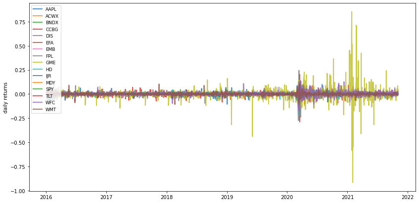
    


```python
import scipy.stats as stats
from scipy.stats import norm
```


```python
# compute the 95% Value at risk using the ppf()
var_95=norm.ppf(0.05, loc=mean_return_rate, scale=std_return_rate)
print("Value at Risk for the given tickers :", var_95)
```

    Value at Risk for the given tickers : [-0.02909241 -0.01830356 -0.00303664 -0.03846929 -0.02778684 -0.01791701
     -0.00974388 -0.03879083 -0.12862282 -0.0247153  -0.02375561 -0.02192748
     -0.01802666 -0.01399495 -0.03436645 -0.0214725 ]
    


```python
#Assuming i decide to invest $200 in each securities. The loss that might result for each if the level confidence is 95% is 
asset=200
print("for each 200 invested in each securities equally, the loss might ",asset*var_95)

```

    for each 200 invested in each securities equally, the loss might  [ -5.81848144  -3.66071127  -0.60732703  -7.69385782  -5.557368
      -3.58340105  -1.94877641  -7.75816565 -25.72456307  -4.94306093
      -4.75112148  -4.3854966   -3.60533114  -2.79898951  -6.87329099
      -4.29449984]
    

#Graphs of the securities part of the investment universe
It helps see the trends of each securities and also the variation of the stocks through a given period of time. The graph of cumulative returns will be presented in order to observe the stocks's return. there will be a series of thwo or three graphs. one might show clearer outpout to infer trends than others. one graph put all of the tickers in pictures and another considers separately each one of them.


```python
tickerData.plot(figsize=(10,12), subplots=True)
```


    array([<matplotlib.axes._subplots.AxesSubplot object at 0x7f51b2a8eed0>,
           <matplotlib.axes._subplots.AxesSubplot object at 0x7f51b2a49490>,
           <matplotlib.axes._subplots.AxesSubplot object at 0x7f51b21667d0>,
           <matplotlib.axes._subplots.AxesSubplot object at 0x7f51b211cb10>,
           <matplotlib.axes._subplots.AxesSubplot object at 0x7f51b20d6e50>,
           <matplotlib.axes._subplots.AxesSubplot object at 0x7f51b209d1d0>,
           <matplotlib.axes._subplots.AxesSubplot object at 0x7f51b2054590>,
           <matplotlib.axes._subplots.AxesSubplot object at 0x7f51b208d7d0>,
           <matplotlib.axes._subplots.AxesSubplot object at 0x7f51b208d810>,
           <matplotlib.axes._subplots.AxesSubplot object at 0x7f51b2045c50>,
           <matplotlib.axes._subplots.AxesSubplot object at 0x7f51b1fc4210>,
           <matplotlib.axes._subplots.AxesSubplot object at 0x7f51b1f7c550>,
           <matplotlib.axes._subplots.AxesSubplot object at 0x7f51b1f35890>,
           <matplotlib.axes._subplots.AxesSubplot object at 0x7f51b1eedbd0>,
           <matplotlib.axes._subplots.AxesSubplot object at 0x7f51b1ead650>,
           <matplotlib.axes._subplots.AxesSubplot object at 0x7f51b1e77350>],
          dtype=object)


    
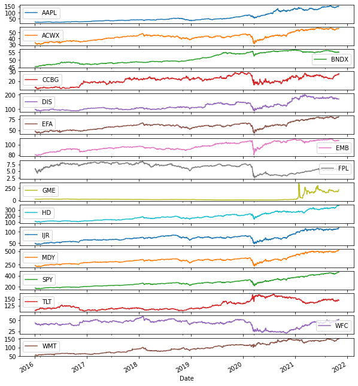
    


```python

print(tickerData.plot(figsize=(15,10)))
```

    AxesSubplot(0.125,0.2;0.775x0.68)
    


    
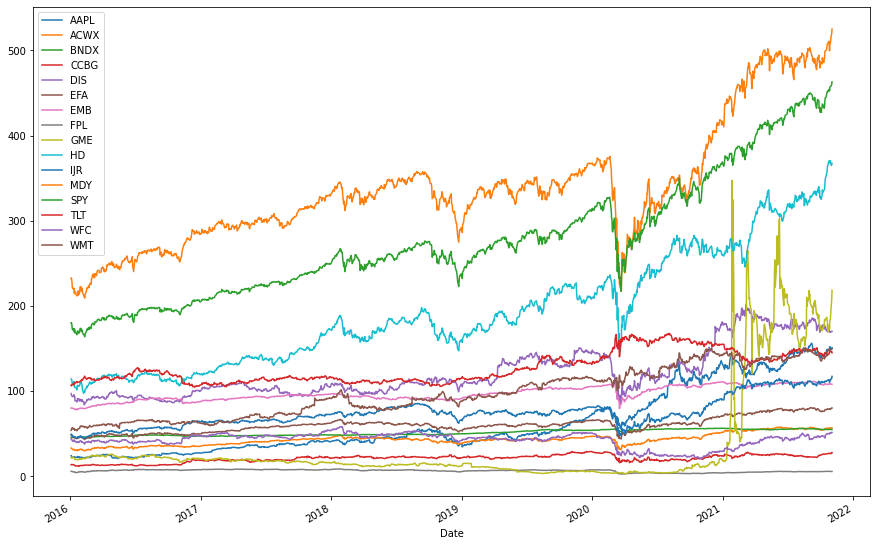
    


```python
ret1=np.log(tickerData/tickerData.shift(1))
ret1.head()
ret1.cumsum().apply(np.exp).plot(figsize=(16,9))
```


    <matplotlib.axes._subplots.AxesSubplot at 0x7f51b19784d0>


    
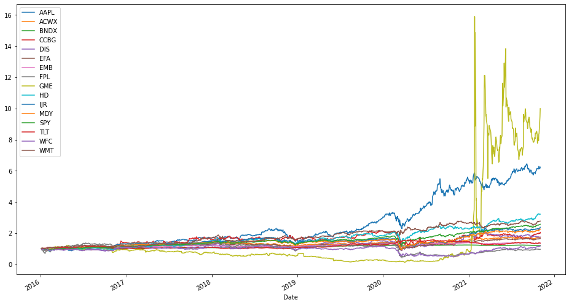
    


# Use PyPortfolioOpt package for portfolio Optimization in **Finance**


```python
#Expected Return and covariance
mu1=expected_returns.mean_historical_return(tickerData)
mu1
```


    AAPL    0.368636
    ACWX    0.096723
    BNDX    0.033450
    CCBG    0.131208
    DIS     0.100750
    EFA     0.090233
    EMB     0.052779
    FPL    -0.006985
    GME     0.483798
    HD      0.221663
    IJR     0.160108
    MDY     0.149723
    SPY     0.175728
    TLT     0.054159
    WFC     0.027721
    WMT     0.190957
    dtype: float64


```python
sigma=risk_models.sample_cov(tickerData).round(3)
sigma
```


  <div id="df-0f24c6de-a28b-480c-adb5-3aabeb4b35fd">
    <div class="colab-df-container">
      <div>
<style scoped>
    .dataframe tbody tr th:only-of-type {
        vertical-align: middle;
    }

    .dataframe tbody tr th {
        vertical-align: top;
    }

    .dataframe thead th {
        text-align: right;
    }
</style>
<table border="1" class="dataframe">
  <thead>
    <tr style="text-align: right;">
      <th></th>
      <th>AAPL</th>
      <th>ACWX</th>
      <th>BNDX</th>
      <th>CCBG</th>
      <th>DIS</th>
      <th>EFA</th>
      <th>EMB</th>
      <th>FPL</th>
      <th>GME</th>
      <th>HD</th>
      <th>IJR</th>
      <th>MDY</th>
      <th>SPY</th>
      <th>TLT</th>
      <th>WFC</th>
      <th>WMT</th>
    </tr>
  </thead>
  <tbody>
    <tr>
      <th>AAPL</th>
      <td>0.087</td>
      <td>0.033</td>
      <td>0.001</td>
      <td>0.029</td>
      <td>0.033</td>
      <td>0.031</td>
      <td>0.011</td>
      <td>0.041</td>
      <td>0.040</td>
      <td>0.038</td>
      <td>0.037</td>
      <td>0.038</td>
      <td>0.040</td>
      <td>-0.010</td>
      <td>0.035</td>
      <td>0.022</td>
    </tr>
    <tr>
      <th>ACWX</th>
      <td>0.033</td>
      <td>0.033</td>
      <td>0.001</td>
      <td>0.035</td>
      <td>0.029</td>
      <td>0.031</td>
      <td>0.012</td>
      <td>0.041</td>
      <td>0.023</td>
      <td>0.029</td>
      <td>0.034</td>
      <td>0.034</td>
      <td>0.029</td>
      <td>-0.008</td>
      <td>0.038</td>
      <td>0.014</td>
    </tr>
    <tr>
      <th>BNDX</th>
      <td>0.001</td>
      <td>0.001</td>
      <td>0.001</td>
      <td>-0.000</td>
      <td>0.000</td>
      <td>0.000</td>
      <td>0.001</td>
      <td>0.001</td>
      <td>-0.001</td>
      <td>0.001</td>
      <td>0.000</td>
      <td>0.000</td>
      <td>0.000</td>
      <td>0.002</td>
      <td>-0.001</td>
      <td>0.000</td>
    </tr>
    <tr>
      <th>CCBG</th>
      <td>0.029</td>
      <td>0.035</td>
      <td>-0.000</td>
      <td>0.143</td>
      <td>0.045</td>
      <td>0.036</td>
      <td>0.012</td>
      <td>0.050</td>
      <td>0.033</td>
      <td>0.041</td>
      <td>0.064</td>
      <td>0.055</td>
      <td>0.037</td>
      <td>-0.018</td>
      <td>0.079</td>
      <td>0.016</td>
    </tr>
    <tr>
      <th>DIS</th>
      <td>0.033</td>
      <td>0.029</td>
      <td>0.000</td>
      <td>0.045</td>
      <td>0.075</td>
      <td>0.029</td>
      <td>0.011</td>
      <td>0.049</td>
      <td>0.026</td>
      <td>0.033</td>
      <td>0.040</td>
      <td>0.039</td>
      <td>0.032</td>
      <td>-0.010</td>
      <td>0.047</td>
      <td>0.015</td>
    </tr>
    <tr>
      <th>EFA</th>
      <td>0.031</td>
      <td>0.031</td>
      <td>0.000</td>
      <td>0.036</td>
      <td>0.029</td>
      <td>0.031</td>
      <td>0.011</td>
      <td>0.039</td>
      <td>0.024</td>
      <td>0.029</td>
      <td>0.033</td>
      <td>0.033</td>
      <td>0.028</td>
      <td>-0.009</td>
      <td>0.039</td>
      <td>0.014</td>
    </tr>
    <tr>
      <th>EMB</th>
      <td>0.011</td>
      <td>0.012</td>
      <td>0.001</td>
      <td>0.012</td>
      <td>0.011</td>
      <td>0.011</td>
      <td>0.009</td>
      <td>0.020</td>
      <td>0.008</td>
      <td>0.011</td>
      <td>0.012</td>
      <td>0.012</td>
      <td>0.010</td>
      <td>0.002</td>
      <td>0.011</td>
      <td>0.003</td>
    </tr>
    <tr>
      <th>FPL</th>
      <td>0.041</td>
      <td>0.041</td>
      <td>0.001</td>
      <td>0.050</td>
      <td>0.049</td>
      <td>0.039</td>
      <td>0.020</td>
      <td>0.142</td>
      <td>0.057</td>
      <td>0.036</td>
      <td>0.052</td>
      <td>0.051</td>
      <td>0.040</td>
      <td>-0.009</td>
      <td>0.060</td>
      <td>0.014</td>
    </tr>
    <tr>
      <th>GME</th>
      <td>0.040</td>
      <td>0.023</td>
      <td>-0.001</td>
      <td>0.033</td>
      <td>0.026</td>
      <td>0.024</td>
      <td>0.008</td>
      <td>0.057</td>
      <td>1.646</td>
      <td>0.023</td>
      <td>0.068</td>
      <td>0.043</td>
      <td>0.026</td>
      <td>-0.016</td>
      <td>0.050</td>
      <td>0.007</td>
    </tr>
    <tr>
      <th>HD</th>
      <td>0.038</td>
      <td>0.029</td>
      <td>0.001</td>
      <td>0.041</td>
      <td>0.033</td>
      <td>0.029</td>
      <td>0.011</td>
      <td>0.036</td>
      <td>0.023</td>
      <td>0.061</td>
      <td>0.037</td>
      <td>0.038</td>
      <td>0.034</td>
      <td>-0.008</td>
      <td>0.042</td>
      <td>0.022</td>
    </tr>
    <tr>
      <th>IJR</th>
      <td>0.037</td>
      <td>0.034</td>
      <td>0.000</td>
      <td>0.064</td>
      <td>0.040</td>
      <td>0.033</td>
      <td>0.012</td>
      <td>0.052</td>
      <td>0.068</td>
      <td>0.037</td>
      <td>0.056</td>
      <td>0.049</td>
      <td>0.036</td>
      <td>-0.012</td>
      <td>0.059</td>
      <td>0.016</td>
    </tr>
    <tr>
      <th>MDY</th>
      <td>0.038</td>
      <td>0.034</td>
      <td>0.000</td>
      <td>0.055</td>
      <td>0.039</td>
      <td>0.033</td>
      <td>0.012</td>
      <td>0.051</td>
      <td>0.043</td>
      <td>0.038</td>
      <td>0.049</td>
      <td>0.047</td>
      <td>0.036</td>
      <td>-0.011</td>
      <td>0.054</td>
      <td>0.017</td>
    </tr>
    <tr>
      <th>SPY</th>
      <td>0.040</td>
      <td>0.029</td>
      <td>0.000</td>
      <td>0.037</td>
      <td>0.032</td>
      <td>0.028</td>
      <td>0.010</td>
      <td>0.040</td>
      <td>0.026</td>
      <td>0.034</td>
      <td>0.036</td>
      <td>0.036</td>
      <td>0.033</td>
      <td>-0.009</td>
      <td>0.041</td>
      <td>0.018</td>
    </tr>
    <tr>
      <th>TLT</th>
      <td>-0.010</td>
      <td>-0.008</td>
      <td>0.002</td>
      <td>-0.018</td>
      <td>-0.010</td>
      <td>-0.009</td>
      <td>0.002</td>
      <td>-0.009</td>
      <td>-0.016</td>
      <td>-0.008</td>
      <td>-0.012</td>
      <td>-0.011</td>
      <td>-0.009</td>
      <td>0.019</td>
      <td>-0.021</td>
      <td>-0.005</td>
    </tr>
    <tr>
      <th>WFC</th>
      <td>0.035</td>
      <td>0.038</td>
      <td>-0.001</td>
      <td>0.079</td>
      <td>0.047</td>
      <td>0.039</td>
      <td>0.011</td>
      <td>0.060</td>
      <td>0.050</td>
      <td>0.042</td>
      <td>0.059</td>
      <td>0.054</td>
      <td>0.041</td>
      <td>-0.021</td>
      <td>0.112</td>
      <td>0.019</td>
    </tr>
    <tr>
      <th>WMT</th>
      <td>0.022</td>
      <td>0.014</td>
      <td>0.000</td>
      <td>0.016</td>
      <td>0.015</td>
      <td>0.014</td>
      <td>0.003</td>
      <td>0.014</td>
      <td>0.007</td>
      <td>0.022</td>
      <td>0.016</td>
      <td>0.017</td>
      <td>0.018</td>
      <td>-0.005</td>
      <td>0.019</td>
      <td>0.046</td>
    </tr>
  </tbody>
</table>
</div>
      <button class="colab-df-convert" onclick="convertToInteractive('df-0f24c6de-a28b-480c-adb5-3aabeb4b35fd')"
              title="Convert this dataframe to an interactive table."
              style="display:none;">

  <svg xmlns="http://www.w3.org/2000/svg" height="24px"viewBox="0 0 24 24"
       width="24px">
    <path d="M0 0h24v24H0V0z" fill="none"/>
    <path d="M18.56 5.44l.94 2.06.94-2.06 2.06-.94-2.06-.94-.94-2.06-.94 2.06-2.06.94zm-11 1L8.5 8.5l.94-2.06 2.06-.94-2.06-.94L8.5 2.5l-.94 2.06-2.06.94zm10 10l.94 2.06.94-2.06 2.06-.94-2.06-.94-.94-2.06-.94 2.06-2.06.94z"/><path d="M17.41 7.96l-1.37-1.37c-.4-.4-.92-.59-1.43-.59-.52 0-1.04.2-1.43.59L10.3 9.45l-7.72 7.72c-.78.78-.78 2.05 0 2.83L4 21.41c.39.39.9.59 1.41.59.51 0 1.02-.2 1.41-.59l7.78-7.78 2.81-2.81c.8-.78.8-2.07 0-2.86zM5.41 20L4 18.59l7.72-7.72 1.47 1.35L5.41 20z"/>
  </svg>
      </button>

  <style>
    .colab-df-container {
      display:flex;
      flex-wrap:wrap;
      gap: 12px;
    }

    .colab-df-convert {
      background-color: #E8F0FE;
      border: none;
      border-radius: 50%;
      cursor: pointer;
      display: none;
      fill: #1967D2;
      height: 32px;
      padding: 0 0 0 0;
      width: 32px;
    }

    .colab-df-convert:hover {
      background-color: #E2EBFA;
      box-shadow: 0px 1px 2px rgba(60, 64, 67, 0.3), 0px 1px 3px 1px rgba(60, 64, 67, 0.15);
      fill: #174EA6;
    }

    [theme=dark] .colab-df-convert {
      background-color: #3B4455;
      fill: #D2E3FC;
    }

    [theme=dark] .colab-df-convert:hover {
      background-color: #434B5C;
      box-shadow: 0px 1px 3px 1px rgba(0, 0, 0, 0.15);
      filter: drop-shadow(0px 1px 2px rgba(0, 0, 0, 0.3));
      fill: #FFFFFF;
    }
  </style>

      <script>
        const buttonEl =
          document.querySelector('#df-0f24c6de-a28b-480c-adb5-3aabeb4b35fd button.colab-df-convert');
        buttonEl.style.display =
          google.colab.kernel.accessAllowed ? 'block' : 'none';

        async function convertToInteractive(key) {
          const element = document.querySelector('#df-0f24c6de-a28b-480c-adb5-3aabeb4b35fd');
          const dataTable =
            await google.colab.kernel.invokeFunction('convertToInteractive',
                                                     [key], {});
          if (!dataTable) return;

          const docLinkHtml = 'Like what you see? Visit the ' +
            '<a target="_blank" href=https://colab.research.google.com/notebooks/data_table.ipynb>data table notebook</a>'
            + ' to learn more about interactive tables.';
          element.innerHTML = '';
          dataTable['output_type'] = 'display_data';
          await google.colab.output.renderOutput(dataTable, element);
          const docLink = document.createElement('div');
          docLink.innerHTML = docLinkHtml;
          element.appendChild(docLink);
        }
      </script>
    </div>
  </div>


```python
efffrontier=EfficientFrontier(mu1,sigma)
weight=efffrontier.max_sharpe()
print(weight)
```

    OrderedDict([('AAPL', 0.3027257585004374), ('ACWX', 0.0), ('BNDX', 0.0), ('CCBG', 0.0138483784164462), ('DIS', 0.0), ('EFA', 0.0), ('EMB', 0.0), ('FPL', 0.0), ('GME', 0.0188268987240255), ('HD', 0.0684347277131864), ('IJR', 0.0), ('MDY', 0.0), ('SPY', 0.0), ('TLT', 0.4178880878877908), ('WFC', 0.0), ('WMT', 0.1782761487581139)])
    

It is important to clean the weights in order to get a good-looking result


```python
clean=efffrontier.clean_weights()
efffrontier.save_weights_to_file("weights.txt")
print(clean)

```

    OrderedDict([('AAPL', 0.30273), ('ACWX', 0.0), ('BNDX', 0.0), ('CCBG', 0.01385), ('DIS', 0.0), ('EFA', 0.0), ('EMB', 0.0), ('FPL', 0.0), ('GME', 0.01883), ('HD', 0.06843), ('IJR', 0.0), ('MDY', 0.0), ('SPY', 0.0), ('TLT', 0.41789), ('WFC', 0.0), ('WMT', 0.17828)])
    


```python
pd.Series(clean).plot.pie(figsize=(18,12))
```


    <matplotlib.axes._subplots.AxesSubplot at 0x7f51af7944d0>


    
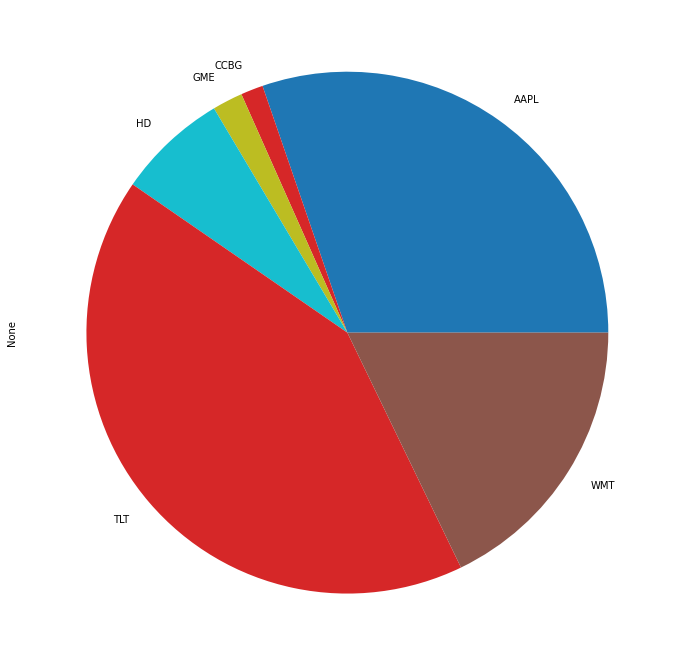
    


##Portfolio performance with optimal weights


```python
efffrontier.portfolio_performance(verbose=True, risk_free_rate=0.02) #GT5:Gov (5 years) is 1.82%, we consider the defaulr for risk free rate is 2%
```

    Expected annual return: 19.4%
    Annual volatility: 12.2%
    Sharpe Ratio: 1.43
    


    (0.19436602397445849, 0.12215511836318298, 1.427414801040475)


```python
ret1.hist(bins=50, sharex=False, sharey=False, xlabelsize=1, figsize=(20,20))
```


    array([[<matplotlib.axes._subplots.AxesSubplot object at 0x7f51af719750>,
            <matplotlib.axes._subplots.AxesSubplot object at 0x7f51af74bd10>,
            <matplotlib.axes._subplots.AxesSubplot object at 0x7f51af70f210>,
            <matplotlib.axes._subplots.AxesSubplot object at 0x7f51af6c6710>],
           [<matplotlib.axes._subplots.AxesSubplot object at 0x7f51af67cc10>,
            <matplotlib.axes._subplots.AxesSubplot object at 0x7f51af63f150>,
            <matplotlib.axes._subplots.AxesSubplot object at 0x7f51af5f66d0>,
            <matplotlib.axes._subplots.AxesSubplot object at 0x7f51af5acb10>],
           [<matplotlib.axes._subplots.AxesSubplot object at 0x7f51af5acb50>,
            <matplotlib.axes._subplots.AxesSubplot object at 0x7f51af571190>,
            <matplotlib.axes._subplots.AxesSubplot object at 0x7f51af4dda90>,
            <matplotlib.axes._subplots.AxesSubplot object at 0x7f51af492f90>],
           [<matplotlib.axes._subplots.AxesSubplot object at 0x7f51af4564d0>,
            <matplotlib.axes._subplots.AxesSubplot object at 0x7f51af48d9d0>,
            <matplotlib.axes._subplots.AxesSubplot object at 0x7f51af443ed0>,
            <matplotlib.axes._subplots.AxesSubplot object at 0x7f51af407410>]],
          dtype=object)


    
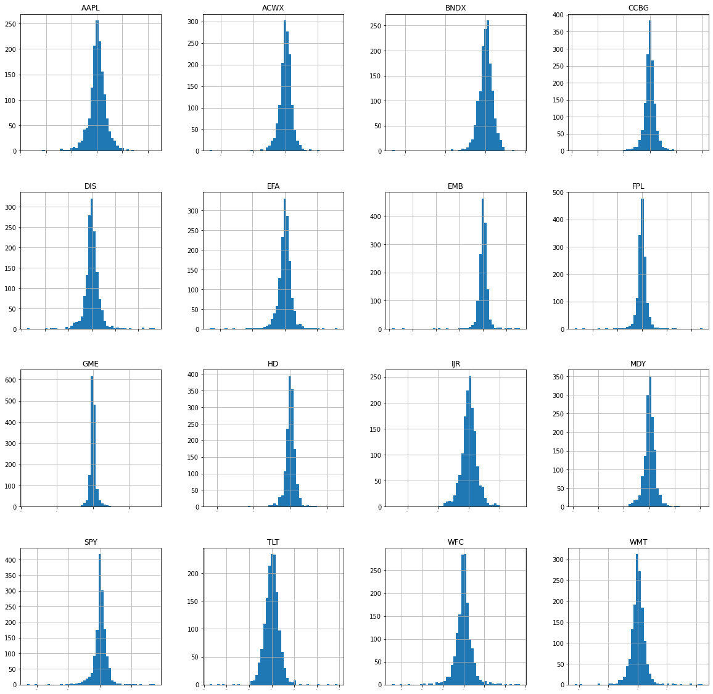
    


```python
import seaborn as sns
```


```python
correlation=ret1.corr()
plt.figure(figsize=(14,16))
plt.title("Correlation Matrix")
sns.heatmap(correlation,vmax=1, square=True, annot=True, cmap="cubehelix")
```


    <matplotlib.axes._subplots.AxesSubplot at 0x7f51ac5d5390>


    
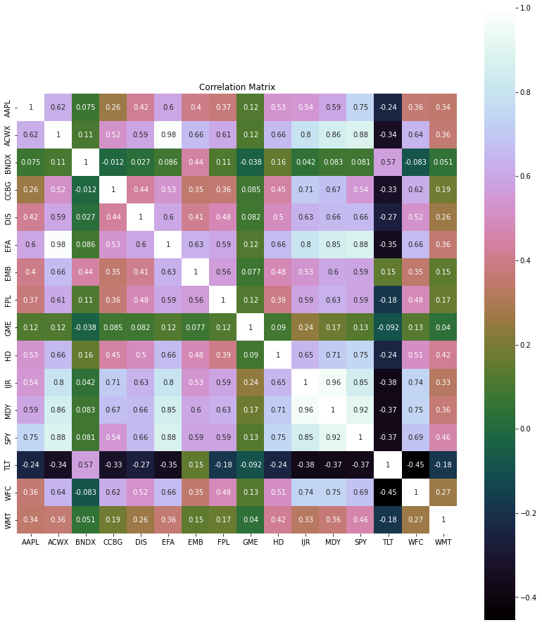
    


##**Efficient Frontier and Allocation**

Let's ask this question, if I would like to invest $ 70, 754.00, how many quantities of share will i be able to buy. We are going to allocate funds in this optimal portfolio given the weights


```python
from pypfopt.discrete_allocation import DiscreteAllocation, get_latest_prices
lates_pr=get_latest_prices(tickerData)
lates_pr
```


    AAPL    151.076767
    ACWX     56.811199
    BNDX     55.080952
    CCBG     27.798615
    DIS     170.080002
    EFA      80.196449
    EMB     108.085625
    FPL       5.712753
    GME     218.330002
    HD      367.450317
    IJR     117.314423
    MDY     525.038391
    SPY     463.093048
    TLT     145.027695
    WFC      51.568459
    WMT     149.577744
    Name: 2021-11-03 00:00:00, dtype: float64


```python
invest=DiscreteAllocation(weight, lates_pr,total_portfolio_value=70754)
allocation, leftover=invest.lp_portfolio()
print(allocation)
print(leftover)
```

    {'AAPL': 142, 'CCBG': 36, 'GME': 6, 'HD': 13, 'TLT': 204, 'WMT': 84}
    63.33465576171875
    


```python
investment=DiscreteAllocation(weight,lates_pr,total_portfolio_value=70754)
allocation, leftover=investment.greedy_portfolio()
print("Discrete allocation",allocation)
print("Fund remaining:${:.2f}".format(leftover))
```

    Discrete allocation {'TLT': 203, 'AAPL': 141, 'WMT': 84, 'HD': 14, 'GME': 6, 'CCBG': 35}
    Fund remaining:$19.79
    


```python
from pypfopt import plotting
```


```python
plotting.plot_weights(clean)
```


    <matplotlib.axes._subplots.AxesSubplot at 0x7f51aa2e6e10>


    
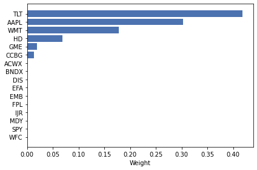
    


A little bit of discussion needs to take place.The function related to EfficientFrontier produces a single optimal portfolio. This means we need all the efficient frontier to be plotted. therefore, we need to establish portfolio considering a range of target risks (a range of standard deviation, a range of target returns (compensation for the risk taken), and a range of risk aversions (utility of the investor). Three functions will come into play: efficient_risk(), efficient_return(), max_quadratic_utility()


```python
from pypfopt.efficient_frontier import EfficientFrontier
from pypfopt import risk_models
from pypfopt import expected_returns
from pypfopt import plotting
ef=EfficientFrontier(mu1, sigma, weight_bounds=(0,1))
```


```python
fig, ax=plt.subplots()
plotting.plot_efficient_frontier(ef, ax=ax, show_assets=True)

```


    <matplotlib.axes._subplots.AxesSubplot at 0x7f51a2229210>


    
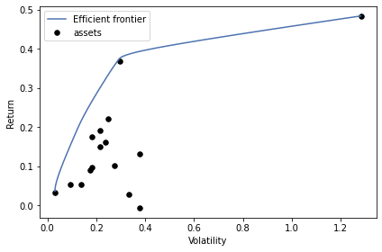
    


```python
# 100 portfolio with risks between 0.10 and 0.60
risk_range=np.linspace(0.10, 0.30, 100)
plotting.plot_efficient_frontier(ef,ef_param_range=risk_range, show_assets=True)

```


    <matplotlib.axes._subplots.AxesSubplot at 0x7f51a003c2d0>


    
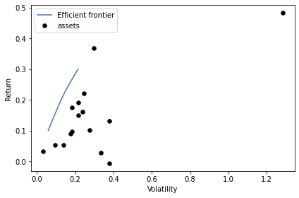
    


```python
#Tangency line of the portfolio
#ef.max_sharpe()


```


```python
ef=EfficientFrontier(mu1, sigma, weight_bounds=(0,1))
fig, ax=plt.subplots()

plotting.plot_efficient_frontier(ef, ax=ax, show_assets=True)
#Tangency line of the portfolio
ret_tangent,std_tangent, _=ef.portfolio_performance()
ax.scatter(std_tangent, ret_tangent, marker="*", s=100, c="r", label="Max Sharpe")
n_samples=20000 #generate random portfolios
w=np.random.dirichlet(np.ones(len(mu1)), n_samples)
rets=w.dot(mu1)
stds=np.sqrt(np.diag(w @ sigma @ w.T))
sharpes=rets/stds
ax.scatter(stds,rets, marker=".", c=sharpes, cmap="viridis_r")
#output
ax.set_title("efficient Frontier with Random Portfolios")
ax.legend()
plt.tight_layout()
plt.savefig("efficient.png", dpi=200)
plt.show()

```


    
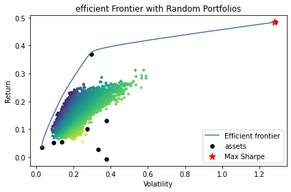
    


##Value at Risk (VaR) and  Conditional Value at Risk (CVaR)


This section will answer the extreme loss of this portfolio an investor might incurr. We will determine the value at risk (VAR) and the conditional value at risk (CVAR) 


*   VaR: Statistic  measuring portfolio maximun portfolio loss at a particular confidence level.
*   the typical confidence levels that will be considered for this given project are 95%
*   CVar measures expected loss given a minum loss equal to the VaR 
* The conditional value at Risk (CVAR), or expected shortfall (ES) asks what the average loss will be, conditional upon losses exceeding some threshold at a certain confidence level.it uses Var as a point of departure.
(*reference*: )


```python
#Compute the 95% Var using .ppf
annual_return=0.194 # Expected annual return
Annual_deviation=0.122 # volatility of the portfolio
# Sharpe Ratio: 1.43
Var_95=norm.ppf(0.05, loc=annual_return, scale=Annual_deviation)
print("Value at Risk for the portfolio is:", Var_95)

```

    Value at Risk for the portfolio is: -0.00667214248807968
    


```python
# Worst 5% of cases
tail_loss=norm.expect(lambda x: x, loc=annual_return, scale=Annual_deviation, lb=0.47)
CVAR=(1-.95)*tail_loss
print("Conditional Value at Risk:",round(CVAR*100,2),"%")
```

    Conditional Value at Risk: 0.03 %
    


```python
from matplotlib import scale
#plot the nominal distribution
plt.hist(norm.rvs(size=10000, loc=0.194, scale=0.122), bins=90)
plt.axvline(x=Var_95, c="r" ,label="Var, 95% confidence level")
plt.axvline(x=CVAR, c="g", label="CVAR, worse 5% of outcome")
plt.legend();plt.show()
```


    
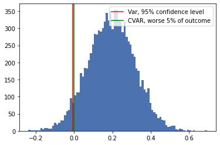
    


I am not really confident about the results. I investigate more about the process. 
