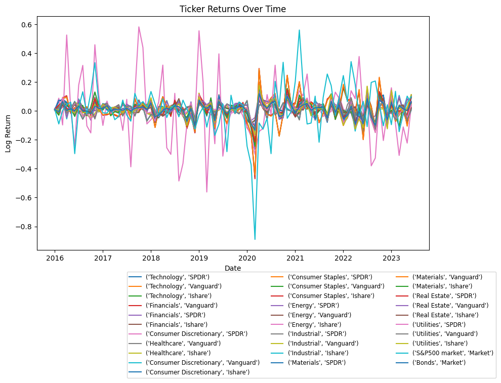
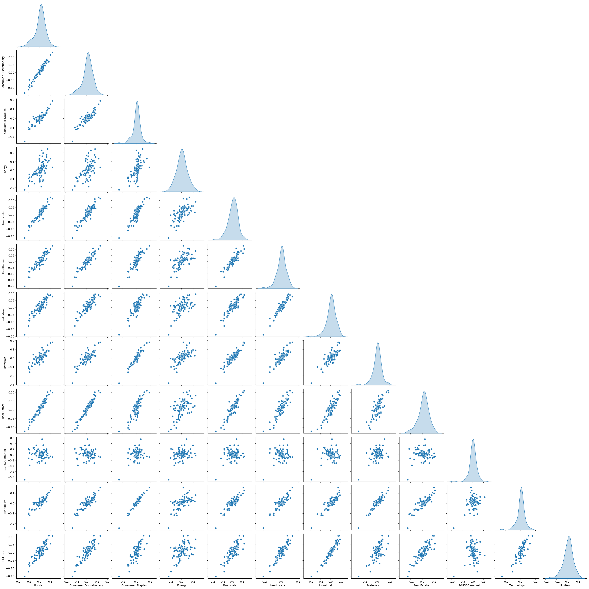
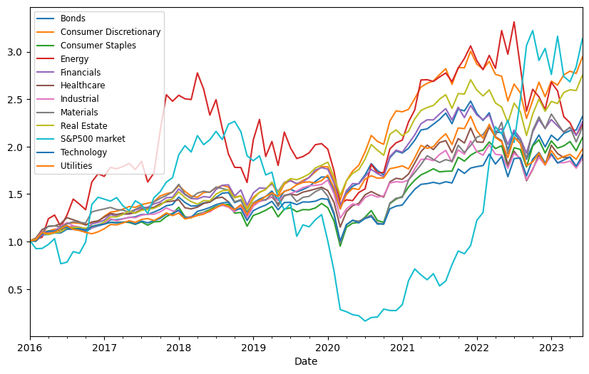
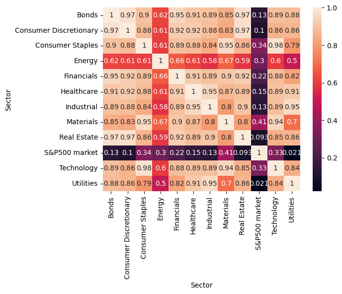
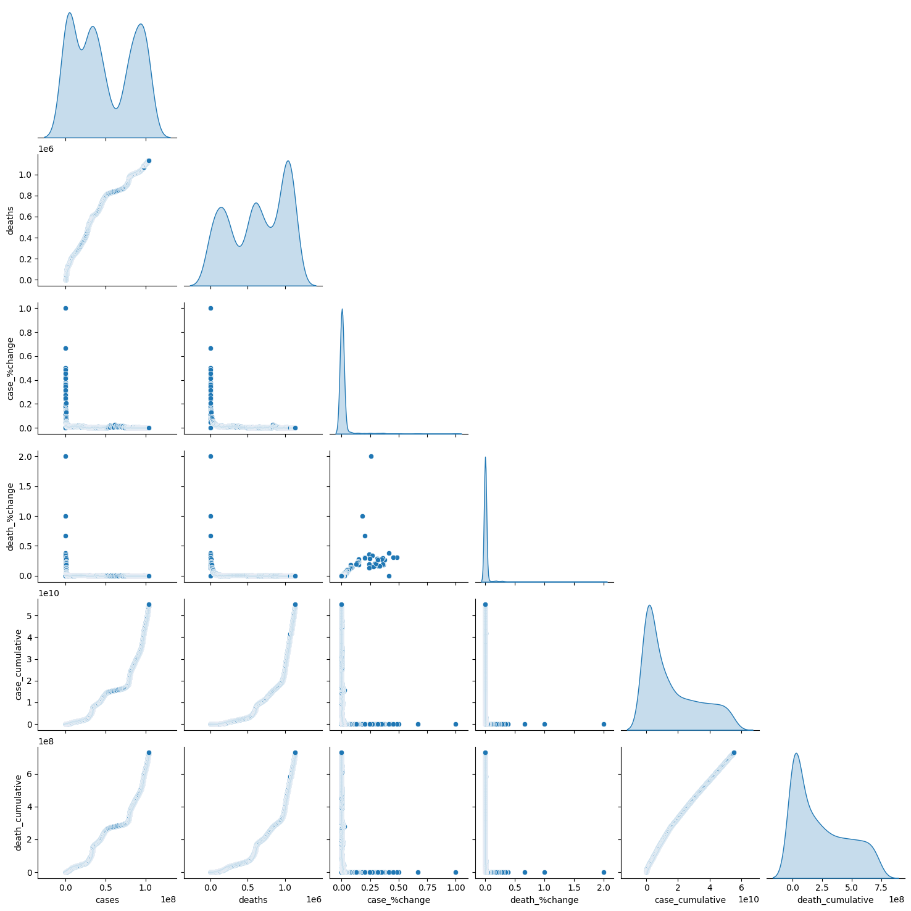
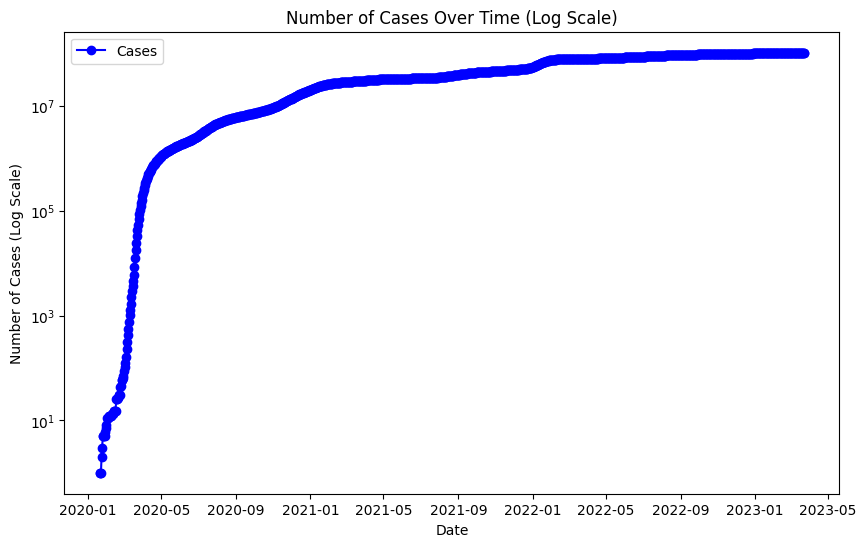
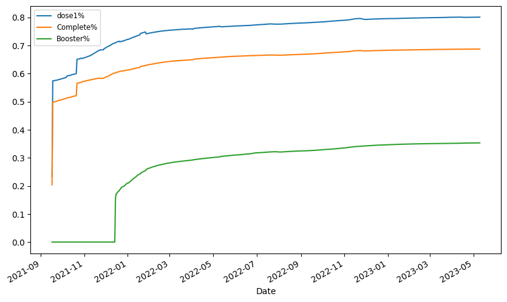

---
title: 'The impact of COVID-19 on the US Stock Market: The Sector that is the most
  sensitive to COVID-19 spread'
  
author: Daniel Sineus
date: '2023-08-12'
slug: the-impact-of-covid-19-on-the-us-stock-market-the-sector-that-is-the-most-sensitive-to-covid-19-spread
categories:
  - research
tags:
  - Academic
  - Stock Market
  - COVID-19
  - Regression Analysis
subtitle: ''
summary: ''
authors: []
lastmod: '2023-08-12T22:00:09-04:00'
featured: no
draft: no
image:
  caption: ''
  focal_point: ''
  preview_only: no
projects: []
---

# ****PAPER CHALLENGE****

**The Impact of COVID-19 on the US Stock Market: The Sector that is most sensitive to COVID-19 spread**


**Abstract**


COVID-19, declared a pandemic by the World Health Organization on March 11, 2020, has had an unprecedented impact on various dimensions of people's lives worldwide. The spread of the virus led to stock market volatility in the United States as the number of cases started to increase. This paper aims to investigate the negative effect of COVID-19 on the stock market, specifically examining whether the stock market significantly declined with the increasing number of cases of this respiratory virus. The primary objective is to comprehend the shock or panic experienced by the stock market as the pandemic became omnipresent in the media. Our analysis will be conducted using statistical and econometric tools, specifically Ordinary Least Squares (OLS) regression. The variables studied include the number of cases, deaths, and vaccinations. The energy, industrial, and material sectors of the stock market have been the most impacted by COVID-19. Among these, the energy sector has faced the most significant impact, resulting in heightened expected risk. However, vaccinations do not appear to be the sole cause of the stock market's recovery.

**Introduction**


The COVID-19 pandemic represents a global outbreak of coronavirus, an infectious disease caused by the severe acute respiratory syndrome coronavirus 2 (SARS-CoV-2) virus (WHO, 2020). Just two years ago, concerns about COVID-19 causing alarming mortality rates persisted. Globally, COVID-19 cases have surpassed 100 million, resulting in over 2 million deaths (Ganie et al., 2022). This pandemic can now be classified as one of the deadliest in recent history, leading to substantial economic losses due to significant contractions and disruptions in financial and labor markets, based on empirical observations. Presently, discussions about COVID-19 have shifted from its deadly nature to the availability of vaccines and boosters, which have contributed to mitigating its impact. However, this paper primarily focuses on the implications of COVID-19 for the financial market. Specifically, it explores the varying sensitivity of different sectors to respiratory viruses, excluding consumer staples. The paper also considers the potential positive influence of vaccine policies on the stock market, instilling confidence and restoring economic activities. The paper's primary objective is to analyze stock market volatility and performance during the COVID-19 pandemic, particularly studying how financial markets responded to increasing COVID-19 cases and the vaccine rollout. The paper's structure involves an introduction to highlight its objective and contextualize the study, a literature review exploring relevant theoretical perspectives, and a results section discussing statistical and econometric findings.

**Literature Review**

The pandemic's severe impact on financial markets globally, including stock, bond, and commodity markets, has been evident. The World Economic Forum (March 2020) noted that "the stock market has responded to the COVID-19 pandemic with significant volatility due to fear-driven panic selling." Somaiya (2022) draws on previous studies demonstrating that stock markets respond to various global events such as natural and man-made disasters (Kowalewski & Spiewanowski, 2020), sports events (Buhagiar et al., 2018), political developments (Bash & Asaifi, 2019), and disease outbreaks like Ebola and severe acute respiratory syndrome (Chen et al., 2007; Ichev & Marinc, 2017). Chen et al. (2009) noted that the hospitality sector was sensitive to SARS, whereas Biotech company stocks in Taiwan experienced positive surprises during the SARS period. The COVID-19 outbreak triggered more frequent stock market index fluctuations than any prior period with an equivalent number of trading days (Baker et al., 2020, in Chatjuthamard, 2021). Unforeseen shocks, such as financial crises and disease outbreaks, can alter economic trends and investor sentiments abruptly. During market downtrends, investors tend to be more pessimistic, leading to increased volatility and decreased future excess returns (Lee et al., 2002). Political decisions aimed at controlling the virus could impact the stock market, as suggested by Pástor and Veronesi (2013), who examined the effect of political uncertainty on stock returns and found that it induces panic, particularly during economic weaknesses. This paper will examine different ETF sectors from three ETFs (iShares, SPDR, Vanguard) and study their performance amid the COVID-19 impact.

**Methodology**

This paper seeks to investigate how the stock market responded to the COVID-19 pandemic's global spread. The research question can be stated as follows: How did the COVID-19 pandemic affect stock market performance across different sectors? The paper considers sector behavior before COVID-19's appearance in the US, its impact during the pandemic's peak, and the subsequent effects of the vaccination policy. Quantitative analysis will be conducted using historical stock market data from the Yahoo Finance database, employing Python and the yfinance package. The data collection period spans from 01/01/2015 to 03/30/2023. The data comprises the S&P 500, the Bond market, and the ETF institutions (iShares, SPDR, Vanguard), which will serve as proxies for various US market sectors. ETFs represent baskets of securities that trade on exchanges like stocks, tracking specific index sectors, commodities, or assets. The paper will consider sectors such as technology, financials, healthcare, consumer discretionary, consumer staples, energy, industrial, materials, real estate, utilities, S&P 500, and bonds. The list of financial tickers is provided in the appendix. Regression analysis will predict sector performance based on changes in COVID-19 cases and vaccination rates. The null hypothesis will be tested to evaluate whether sector performance is negatively impacted by COVID-19 cases and positively influenced by increased vaccination.

Before conducting the regression analysis, it is assumed that the relationships between variables are normally distributed. The statistical techniques used involve time-series analysis to identify stock market trends and changes, regression analysis to ascertain relationships between COVID-19 variables and stock market performance, and sector-based analysis to uncover variations across sectors. Data collection covers the period from 01/01/2016 to 06/23/2023. The analysis relies on expected means and standard deviations to assess risks over time, as well as regression analysis.

**Results**


In this section, the results of the statistical and regression analyses conducted in Python will be presented. One table from the regression analysis will be included in the main text, while additional tables will be provided in the appendix for the sake of conciseness and the paper's length constraint. Figure 1 shows the S&P 500 market returns experienced a sharp decline at the onset of the pandemic. Expected returns for all sectors were lower than the previous two years' expectations.

Figure 1 - Trend for daily expected returns
The regression model indicates that the majority of sectors' p-values are not significant for predicting performance based on COVID-19 cases. However, the energy, industrial, and materials sectors exhibit significant relationships with the model.

Energy Sector:

• An R-squared value of 0.658 suggests that around 65.8% of the variation in the Energy sector's performance can be explained by the independent variables in the model.
• The COVID-19 cases variable holds statistical significance with a negative coefficient of -0.3910

 (p-value = 0.035). This implies that changes in COVID-19 cases are likely to negatively impact the Energy sector. The decrease in demand due to restrictions, remote work, and reduced travel significantly affected fuel consumption. The sector's expected return may drop by 39.10% with a 1% increase in COVID-19 cases (see regression table in the Appendix).

Industrial Sector:

• An R-squared value suggests that approximately 89.9% of the variation in the Industrial sector's performance can be explained by the independent variables. The COVID-19 cases variable is also significant and negatively influences the sector's performance. The pandemic disrupted supply chains as fewer people were able to gather in production sites, leading to manufacturing, shipping, and logistics disruptions. The expected return for the industrial sector might decline by 51.75% with a 1% increase in COVID-19 cases (see regression table in the Appendix).

Materials Sector:

• An R-squared value of 0.750 indicates that around 75.0% of the variation in Materials' performance can be explained by the independent variables in the model.
• The COVID-19 cases variable is statistically significant with a negative coefficient of -0.3446 (p-value = 0.028), indicating that changes in the number of COVID-19 cases might negatively impact the Materials sector. If cases increase by 1%, the expected return for the materials sector could decline by an average of 34.46% (see regression table in the Appendix).

The impact of COVID-19 varies across sectors, with significant negative effects observed in the energy, industrial, and materials sectors. However, for most sectors, the COVID-19 variable lacks statistical significance, suggesting that sector performance is not strongly correlated with changes in COVID-19 cases. This observation holds true for sectors like consumer staples and consumer discretionary. It's essential to emphasize that correlation does not imply causation, and the regression findings offer insights into the relationships among analyzed variables. The vaccination policy is expected to positively influence the stock market by instilling confidence among individuals to resume their normal lives.

**Discussion**

The regression analysis highlights that COVID-19 has significantly impacted the energy, materials, and industrial sectors. Conversely, the model does not support the notion that consumer staples and other sectors were significantly affected by COVID-19. These sectors represent non-essential goods that individuals can often obtain through alternative means. Throughout the pandemic, the stock market, particularly the energy sector, exhibited volatility (see Figure 2 in the Appendix). Notably, signs of market stability or a potential rally were observed even before the vaccination policy was implemented (see Figure 3).


**Conclusion**

In conclusion, this study revealed the intricate relationship between the COVID-19 pandemic and the US stock market. Sectors like energy, industrial, and materials were hit the hardest, experiencing substantial declines due to COVID-19 and also disruptions in demand and supply chains. Conversely, sectors like consumer staples and consumer discretionary showed resilience. The availability of vaccines boosted market confidence and economic activities, but the market started to rally before vaccines appeared. However, the complex interplay of variables and the unprecedented nature of the pandemic warrant ongoing exploration. This research underscores the need for informed policy decisions that bolster sectoral resilience during crises, highlighting the interdependence of public health and the economy. As we navigate an uncertain future, the insights gained here provide valuable guidance for more robust economic strategies.


**References**

World Health Organization. (n.d.). COVID-19 situation in the European Region. Retrieved from https://www.who.int/europe/emergencies/situations/covid-19

World Economic Forum. (2020, March 16). How coronavirus is affecting the stock market. Retrieved from https://www.weforum.org/agenda/2020/03/stock-market-volatility-coronavirus/

World Economic Forum. (2020, March). Stock market volatility: How to cope with coronavirus-related market swings. World Economic Forum. https://www.weforum.org/agenda/2020/03/stock-market-volatility-coronavirus/

National Library of Medicine. (2021). The Impact of COVID-19 on College Students and Their Families. National Center for Biotechnology Information. https://www.ncbi.nlm.nih.gov/pmc/articles/PMC8441683/

Lee, et al. (2002). Stock market volatility, excess returns, and the role of investor sentiment. Retrieved from https://doi.org/10.1016/S0378-4266(01)00202-3


```python

!pip install --upgrade yfinance
```

   

```python
%matplotlib inline
import pandas as pd
import numpy as np
import matplotlib.pyplot as plt
import seaborn as sns
import yfinance as yf
```


```python

# Define a dictionary with ETF tickers, names, and sectors
etf_data = {
    'XLK': {'Name': 'SPDR', 'Sector': 'Technology'},
    'VGT': {'Name': 'Vanguard', 'Sector': 'Technology'},
    'IYW': {'Name': 'Ishare', 'Sector': 'Technology'},
    'VFH': {'Name': 'Vanguard', 'Sector': 'Financials'},
    "XLF": {"Name": "SPDR", "Sector": "Financials"},
    "IYF": {"Name": "Ishare", "Sector": "Financials"},
    "XLY": {"Name": "SPDR", "Sector": "Healthcare"},
    "VHI": {"Name": "Vanguard", "Sector": "Healthcare"},
    "IYH": {"Name": "Ishare", "Sector": "Healthcare"},
    "IYF": {"Name": "Ishare", "Sector": "Financials"},
    "XLY": {"Name": "SPDR", "Sector": "Consumer Discretionary"},
    "VCR": {"Name": "Vanguard", "Sector": "Consumer Discretionary"},
    "IYC": {"Name": "Ishare", "Sector": "Consumer Discretionary"},
    "XLP": {"Name": "SPDR", "Sector": "Consumer Staples"},
    "VDC": {"Name": "Vanguard", "Sector": "Consumer Staples"},
    "IYK": {"Name": "Ishare", "Sector": "Consumer Staples"},
    "XLE": {"Name": "SPDR", "Sector": "Energy"},
    "VDE": {"Name": "Vanguard", "Sector": "Energy"},
    "IYE": {"Name": "Ishare", "Sector": "Energy"},
    "XLI": {"Name": "SPDR", "Sector": "Industrial"},
    "VIS": {"Name": "Vanguard", "Sector": "Industrial"},
    "IYJ": {"Name": "Ishare", "Sector": "Industrial"},
    "XLB": {"Name": "SPDR", "Sector": "Materials"},
    "VAW": {"Name": "Vanguard", "Sector": "Materials"},
    "IYM": {"Name": "Ishare", "Sector": "Materials"},
    "XLRE": {"Name": "SPDR", "Sector": "Real Estate"},
    "VNQ": {"Name": "Vanguard", "Sector": "Real Estate"},
    "IYR": {"Name": "Ishare", "Sector": "Real Estate"},
    "XLU": {"Name": "SPDR", "Sector": "Utilities"},
    "VPU": {"Name": "Vanguard", "Sector": "Utilities"},
    "IDU": {"Name": "Ishare", "Sector": "Utilities"},
  "^GSPC": {"Name": "Market", "Sector":"S&P500 market"},
  "^FVX": {"Name": "Market", "Sector":"Bonds"}
    # Add more tickers, names, and sectors as needed
}

# Create an empty DataFrame to store the combined data
combined_data = pd.DataFrame()

# Loop through each ETF ticker, name, and sector
for ticker, data in etf_data.items():
    try:
        # Retrieve the historical data for the ETF
        data_df = yf.download(ticker, start='2016-01-01', end='2023-06-25', period="1mo", interval="1mo")

        # Add columns for ETF ticker, name, and sector
        data_df['Ticker'] = ticker
        data_df['Name'] = data['Name']
        data_df['Sector'] = data['Sector']

        # Append the data to the combined DataFrame
        combined_data = combined_data.append(data_df)
    except Exception as e:
        print(f"An error occurred while fetching data for {ticker}: {e}")

# Print the combined data
print(combined_data.head())
```

  
                     Open       High        Low      Close  Adj Close     Volume  \
    Date                                                                           
    2016-01-01  42.060001  42.500000  38.029999  41.240002  37.493610  340881700   
    2016-02-01  41.070000  41.639999  38.250000  40.970001  37.248127  293589600   
    2016-03-01  41.320000  44.669998  41.259998  44.360001  40.330170  228773000   
    2016-04-01  44.049999  44.730000  41.820000  42.130001  38.496376  207864500   
    2016-05-01  42.220001  44.250000  41.759998  44.189999  40.378704  204116700   
    
               Ticker  Name      Sector  
    Date                                 
    2016-01-01    XLK  SPDR  Technology  
    2016-02-01    XLK  SPDR  Technology  
    2016-03-01    XLK  SPDR  Technology  
    2016-04-01    XLK  SPDR  Technology  
    2016-05-01    XLK  SPDR  Technology  
    

```python
# Save the combined data as a CSV file
combined_data.to_csv('etf_data.csv', index=True)
```


```python
data=pd.read_csv("etf_data.csv", index_col="Date", parse_dates=True)
data=data.iloc[:, 4:]
data.head()
```


```python
# check the summary statistics of the data
data.groupby("Ticker")["Adj Close"].describe().round(2)
```


```python
data.groupby(["Sector", "Name", "Ticker"])["Adj Close"].describe()
```


```python
data["log return"]=data.groupby("Ticker")["Adj Close"].apply(lambda x: np.log(x/x.shift(1)))
print(data)
data_mean=data.groupby("Ticker")["log return"].apply(lambda x:np.mean(x))
print(data_mean)
```

                Adj Close     Volume Ticker    Name      Sector  log return
    Date                                                                   
    2016-01-01  37.493610  340881700    XLK    SPDR  Technology         NaN
    2016-02-01  37.248127  293589600    XLK    SPDR  Technology    0.017343
    2016-03-01  40.330170  228773000    XLK    SPDR  Technology    0.071375
    2016-04-01  38.496376  207864500    XLK    SPDR  Technology   -0.013867
    2016-05-01  40.378704  204116700    XLK    SPDR  Technology    0.015570
    ...               ...        ...    ...     ...         ...         ...
    2023-02-01   4.168000          0   ^FVX  Market       Bonds   -0.026459
    2023-03-01   3.611000          0   ^FVX  Market       Bonds    0.034451
    2023-04-01   3.536000          0   ^FVX  Market       Bonds    0.014536
    2023-05-01   3.743000          0   ^FVX  Market       Bonds    0.002479
    2023-06-01   4.133000          0   ^FVX  Market       Bonds    0.062719
    
    [2790 rows x 6 columns]
    Ticker
    IDU      0.010273
    IYC      0.010091
    IYE      0.000833
    IYF      0.009814
    IYH      0.004665
    IYJ      0.006680
    IYK      0.006819
    IYM      0.008880
    IYR      0.006407
    IYW      0.006129
    VAW      0.007275
    VCR      0.017034
    VDC      0.006637
    VDE      0.017360
    VFH      0.008272
    VGT      0.008892
    VHI      0.009768
    VIS      0.004140
    VNQ      0.017213
    VPU      0.006731
    XLB      0.010171
    XLE      0.008545
    XLF      0.009093
    XLI      0.010065
    XLK      0.006407
    XLP      0.011155
    XLRE     0.010106
    XLU      0.005651
    XLY      0.008852
    ^FVX     0.009328
    ^GSPC    0.012697
    Name: log return, dtype: float64
    


```python
data.isnull().sum()


```


    Adj Close      0
    Volume         0
    Ticker         0
    Name           0
    Sector         0
    log return    31
    dtype: int64


```python
data["log return"]=data.groupby("Ticker")["log return"].transform(lambda x: x.fillna(x.mean())) # or I could have used x.fillna(x.mean())
data.head(10)
```


```python

# Transpose the returns using pivot
transposed_data=data.pivot(columns=["Sector", "Name"],values="log return")

# Display the transposed data
print(transposed_data.head(5))


```

    Sector     Technology                     Financials                      \
    Name             SPDR  Vanguard    Ishare   Vanguard      SPDR    Ishare   
    Date                                                                       
    2016-01-01   0.006407  0.008892  0.006129   0.008272  0.009093  0.009814   
    2016-02-01   0.017343  0.008870 -0.022940  -0.025836 -0.002630  0.028899   
    2016-03-01   0.071375  0.053892  0.086750   0.067348  0.027701  0.071224   
    2016-04-01  -0.013867 -0.007838  0.093511   0.031440  0.031744  0.018666   
    2016-05-01   0.015570  0.003735 -0.012732   0.022419  0.022752  0.006970   
    
    Sector     Consumer Discretionary Healthcare           Consumer Discretionary  \
    Name                         SPDR   Vanguard    Ishare               Vanguard   
    Date                                                                            
    2016-01-01               0.008852   0.009768  0.004665               0.017034   
    2016-02-01               0.006470   0.066671 -0.007528              -0.012652   
    2016-03-01               0.050574   0.080543  0.085774               0.084183   
    2016-04-01               0.000155   0.061312 -0.004985              -0.055323   
    2016-05-01               0.004900  -0.011655  0.021834               0.055250   
    
    Sector      ... Materials           Real Estate                     Utilities  \
    Name        ...  Vanguard    Ishare        SPDR  Vanguard    Ishare      SPDR   
    Date        ...                                                                 
    2016-01-01  ...  0.007275  0.008880    0.010106  0.017213  0.006407  0.005651   
    2016-02-01  ... -0.028401 -0.029435    0.041726 -0.006569  0.003147  0.004785   
    2016-03-01  ...  0.089703  0.064716    0.062294  0.079498  0.041168  0.092113   
    2016-04-01  ...  0.093883  0.039796    0.017480 -0.046536 -0.009300 -0.015038   
    2016-05-01  ... -0.009377  0.018700   -0.004283  0.047738  0.006859  0.017062   
    
    Sector                         S&P500 market     Bonds  
    Name        Vanguard    Ishare        Market    Market  
    Date                                                    
    2016-01-01  0.006731  0.010273      0.012697  0.009328  
    2016-02-01  0.019189  0.004443     -0.090080 -0.004137  
    2016-03-01  0.069252  0.060720      0.003273  0.063905  
    2016-04-01 -0.016990  0.005371      0.043954  0.002696  
    2016-05-01  0.014964  0.000505      0.060671  0.015208  
    
    [5 rows x 31 columns]
    


```python
import matplotlib.pyplot as plt

# Assuming 'transposed_data' is your transposed DataFrame with ticker returns

# Plotting the line graph
plt.figure(figsize=(10, 6))  # Set the figure size (width, height)

# Iterate through each column (ticker) and plot the line
for column in transposed_data.columns:
    plt.plot(transposed_data.index, transposed_data[column], label=column)

# Adding labels and title to the plot
plt.xlabel('Date')
plt.ylabel('Log Return')
plt.title('Ticker Returns Over Time')

# Adding a legend to the plot
plt.legend(fontsize="small", loc="upper center", bbox_to_anchor=(0.7, -0.08), ncol=3)

# Displaying the plot
plt.show()
```


    

    


```python
data1=data.groupby(["Date","Sector"])[["log return"]].mean()
data1.head(10)
```


```python
data2=data.groupby(["Date", "Sector"])["log return"].aggregate("mean").unstack()
data2.head()
```


```python
sectgrap=sns.pairplot(data2, diag_kind="kde", corner=True)
# the dataset is normally distributed
data3=data2.cumsum()
#Plot the cumulative data
data3.apply(np.exp).plot(figsize=(10,6))
plt.legend(fontsize="small")

plt.show()
```


    

    


    

    


```python
corr=sns.heatmap(data2.corr(), annot=True)
round(data2.corr(), ndigits=2)
```


    

    


```python
covid=pd.read_csv("https://raw.githubusercontent.com/nytimes/covid-19-data/master/us.csv", index_col="date", parse_dates=True)# Datasetfrom New York Times
covid.head()
covid.info()


```

    <class 'pandas.core.frame.DataFrame'>
    DatetimeIndex: 1158 entries, 2020-01-21 to 2023-03-23
    Data columns (total 2 columns):
     #   Column  Non-Null Count  Dtype
    ---  ------  --------------  -----
     0   cases   1158 non-null   int64
     1   deaths  1158 non-null   int64
    dtypes: int64(2)
    memory usage: 27.1 KB
    


```python
covid.isnull().any()
```


    cases     False
    deaths    False
    dtype: bool


```python
covid["case_%change"]=covid["cases"].pct_change()
covid["death_%change"]=covid["deaths"].pct_change()

```


```python
covid["case_cumulative"]=covid["cases"].cumsum()
covid["death_cumulative"]=covid["deaths"].cumsum()
covid.tail()
grid=sns.pairplot(covid, diag_kind="kde", corner=True)
```


    

    


```python
covid.head(10)
covid.tail()
```


```python
import matplotlib.pyplot as plt

# Assuming you have a DataFrame called 'data' with columns: date, cases, case_cumulative
plt.figure(figsize=(10, 6))  # Set the figure size (width, height)

# Plotting the data with a logarithmic y-axis
plt.semilogy(covid.index, covid['cases'], marker='o', color='b', label='Cases')

# Adding labels and title to the plot
plt.xlabel('Date')
plt.ylabel('Number of Cases (Log Scale)')
plt.title('Number of Cases Over Time (Log Scale)')
plt.legend()

# Displaying the plot
plt.show()


```


    

    


```python

```


```python
vaccination = pd.read_csv("COVID_Vaccinations_US.csv", index_col="Date", parse_dates=True)
vaccination=vaccination[["Administered_Dose1_Recip", "Series_Complete_Yes", "Booster_Doses"]]
vacin=vaccination.groupby(vaccination.index).sum()
vacin.describe().round(2)

```


```python
vacin.head()
vacin.info()
vacin.dtypes
```

    <class 'pandas.core.frame.DataFrame'>
    DatetimeIndex: 320 entries, 2021-09-17 to 2023-05-10
    Data columns (total 3 columns):
     #   Column                    Non-Null Count  Dtype  
    ---  ------                    --------------  -----  
     0   Administered_Dose1_Recip  320 non-null    float64
     1   Series_Complete_Yes       320 non-null    float64
     2   Booster_Doses             320 non-null    float64
    dtypes: float64(3)
    memory usage: 10.0 KB
    


    Administered_Dose1_Recip    float64
    Series_Complete_Yes         float64
    Booster_Doses               float64
    dtype: object


```python
vacin.head()
```


```python
#https://www.commerce.gov/news/blog/2022/01/us-population-estimated-332403650-jan-1-2022
# the populations is estimated at 332,403,650
#As our nation prepares to ring in the new year, the U.S. Census Bureau projects the United States population will be 332,403,650 on Jan. 1, 2022.
columns_1=["dose1%", "Complete%", "Booster%"]
vacin[columns_1]=vacin/ 332403650

```


```python
vacin.head()
```


```python
vacin.dtypes
```


    Administered_Dose1_Recip    float64
    Series_Complete_Yes         float64
    Booster_Doses               float64
    dose1%                      float64
    Complete%                   float64
    Booster%                    float64
    dtype: object


```python
vacin.isnull().any()
vacin.isnull().sum()

```


    Administered_Dose1_Recip    0
    Series_Complete_Yes         0
    Booster_Doses               0
    dose1%                      0
    Complete%                   0
    Booster%                    0
    dtype: int64


```python
vacin1=vacin.iloc[:,3:]
vacin1.tail(5)
```


```python
dat=vacin1
#Plot the cumulative data
dat.plot(figsize=(10,6))
plt.legend(fontsize="small")
plt.show()

```


    

    


```python
#Plot the cumulative data
covid['case_%change'].cumsum().plot(figsize=(10,6))
plt.legend(fontsize="small")
plt.show()
```


    

    


```python
merge_data=pd.merge(data2, covid, left_index=True, right_index=True)
```


```python
merge_data.describe()
merge_data.head()
merge_data.tail()
```


```python
merge_data.info()
```

    <class 'pandas.core.frame.DataFrame'>
    DatetimeIndex: 38 entries, 2020-02-01 to 2023-03-01
    Data columns (total 18 columns):
     #   Column                  Non-Null Count  Dtype  
    ---  ------                  --------------  -----  
     0   Bonds                   38 non-null     float64
     1   Consumer Discretionary  38 non-null     float64
     2   Consumer Staples        38 non-null     float64
     3   Energy                  38 non-null     float64
     4   Financials              38 non-null     float64
     5   Healthcare              38 non-null     float64
     6   Industrial              38 non-null     float64
     7   Materials               38 non-null     float64
     8   Real Estate             38 non-null     float64
     9   S&P500 market           38 non-null     float64
     10  Technology              38 non-null     float64
     11  Utilities               38 non-null     float64
     12  cases                   38 non-null     int64  
     13  deaths                  38 non-null     int64  
     14  case_%change            38 non-null     float64
     15  death_%change           37 non-null     float64
     16  case_cumulative         38 non-null     int64  
     17  death_cumulative        38 non-null     int64  
    dtypes: float64(14), int64(4)
    memory usage: 5.6 KB
    


```python
dat.plot(figsize=(10,6))
plt.plot(merge_data['S&P500 market'])
plt.legend(fontsize="small")
covid['case_%change'].cumsum().plot(figsize=(10,6))
plt.legend()
plt.show()


```


    

    


```python

# Set the figure size
plt.figure(figsize=(10, 6))

# Plot COVID-19 cases against the left y-axis
plt.plot(covid.index, covid['cases'], color='b', label='COVID-19 Cases')

# Create a second y-axis on the right side for S&P 500 return
ax2 = plt.gca().twinx()
ax2.plot(merge_data.index, merge_data['S&P500 market'], color='r', label='S&P 500 Return')

# Adding labels and title to the plot
plt.xlabel('Date')
plt.ylabel('COVID-19 Cases')
ax2.set_ylabel('S&P 500 Return')
plt.title('COVID-19 Cases vs. S&P 500 Return Over Time')

# Adding legends for both lines on their respective y-axes
plt.legend(loc='upper left')
ax2.legend(loc='upper right')

# Displaying the plot
plt.show()
```


    

    


```python

import statsmodels.api as sm

# Perform the regression analysis and store results in 'results' dictionary
X = merge_data[["case_%change"]] # independent variables
X = sm.add_constant(X) # add a constant to the independent variables
Y = merge_data[['Consumer Discretionary', "Consumer Staples", "Energy", "Financials", "Healthcare", "Industrial", "Materials", "Real Estate"]]
results = {}
for col in Y.columns:
    model = sm.OLS(Y[col], X).fit()
    results[col] = model

# Iterate through results and print them
for col, model in results.items():
    print(f"Regression results for {col}:")
    print(model.summary())
    print("\n")

```

    Regression results for Consumer Discretionary:
                                  OLS Regression Results                              
    ==================================================================================
    Dep. Variable:     Consumer Discretionary   R-squared:                       0.065
    Model:                                OLS   Adj. R-squared:                  0.039
    Method:                     Least Squares   F-statistic:                     2.488
    Date:                    Sun, 13 Aug 2023   Prob (F-statistic):              0.123
    Time:                            15:38:28   Log-Likelihood:                 53.258
    No. Observations:                      38   AIC:                            -102.5
    Df Residuals:                          36   BIC:                            -99.24
    Df Model:                               1                                         
    Covariance Type:                nonrobust                                         
    ================================================================================
                       coef    std err          t      P>|t|      [0.025      0.975]
    --------------------------------------------------------------------------------
    const            0.0172      0.011      1.624      0.113      -0.004       0.039
    case_%change    -0.3117      0.198     -1.577      0.123      -0.712       0.089
    ==============================================================================
    Omnibus:                        0.326   Durbin-Watson:                   2.168
    Prob(Omnibus):                  0.850   Jarque-Bera (JB):                0.059
    Skew:                           0.096   Prob(JB):                        0.971
    Kurtosis:                       3.022   Cond. No.                         19.9
    ==============================================================================
    
    Notes:
    [1] Standard Errors assume that the covariance matrix of the errors is correctly specified.
    
    
    Regression results for Consumer Staples:
                                OLS Regression Results                            
    ==============================================================================
    Dep. Variable:       Consumer Staples   R-squared:                       0.138
    Model:                            OLS   Adj. R-squared:                  0.114
    Method:                 Least Squares   F-statistic:                     5.765
    Date:                Sun, 13 Aug 2023   Prob (F-statistic):             0.0216
    Time:                        15:38:28   Log-Likelihood:                 46.627
    No. Observations:                  38   AIC:                            -89.25
    Df Residuals:                      36   BIC:                            -85.98
    Df Model:                           1                                         
    Covariance Type:            nonrobust                                         
    ================================================================================
                       coef    std err          t      P>|t|      [0.025      0.975]
    --------------------------------------------------------------------------------
    const            0.0208      0.013      1.652      0.107      -0.005       0.046
    case_%change    -0.5649      0.235     -2.401      0.022      -1.042      -0.088
    ==============================================================================
    Omnibus:                       11.981   Durbin-Watson:                   2.484
    Prob(Omnibus):                  0.003   Jarque-Bera (JB):               15.282
    Skew:                           0.877   Prob(JB):                     0.000480
    Kurtosis:                       5.564   Cond. No.                         19.9
    ==============================================================================
    
    Notes:
    [1] Standard Errors assume that the covariance matrix of the errors is correctly specified.
    
    
    Regression results for Energy:
                                OLS Regression Results                            
    ==============================================================================
    Dep. Variable:                 Energy   R-squared:                       0.174
    Model:                            OLS   Adj. R-squared:                  0.151
    Method:                 Least Squares   F-statistic:                     7.569
    Date:                Sun, 13 Aug 2023   Prob (F-statistic):            0.00923
    Time:                        15:38:28   Log-Likelihood:                 42.471
    No. Observations:                  38   AIC:                            -80.94
    Df Residuals:                      36   BIC:                            -77.67
    Df Model:                           1                                         
    Covariance Type:            nonrobust                                         
    ================================================================================
                       coef    std err          t      P>|t|      [0.025      0.975]
    --------------------------------------------------------------------------------
    const            0.0177      0.014      1.255      0.218      -0.011       0.046
    case_%change    -0.7221      0.262     -2.751      0.009      -1.254      -0.190
    ==============================================================================
    Omnibus:                        0.681   Durbin-Watson:                   2.211
    Prob(Omnibus):                  0.712   Jarque-Bera (JB):                0.558
    Skew:                          -0.283   Prob(JB):                        0.756
    Kurtosis:                       2.820   Cond. No.                         19.9
    ==============================================================================
    
    Notes:
    [1] Standard Errors assume that the covariance matrix of the errors is correctly specified.
    
    
    Regression results for Financials:
                                OLS Regression Results                            
    ==============================================================================
    Dep. Variable:             Financials   R-squared:                       0.110
    Model:                            OLS   Adj. R-squared:                  0.086
    Method:                 Least Squares   F-statistic:                     4.471
    Date:                Sun, 13 Aug 2023   Prob (F-statistic):             0.0415
    Time:                        15:38:28   Log-Likelihood:                 55.197
    No. Observations:                  38   AIC:                            -106.4
    Df Residuals:                      36   BIC:                            -103.1
    Df Model:                           1                                         
    Covariance Type:            nonrobust                                         
    ================================================================================
                       coef    std err          t      P>|t|      [0.025      0.975]
    --------------------------------------------------------------------------------
    const            0.0127      0.010      1.261      0.215      -0.008       0.033
    case_%change    -0.3970      0.188     -2.114      0.041      -0.778      -0.016
    ==============================================================================
    Omnibus:                        1.806   Durbin-Watson:                   2.327
    Prob(Omnibus):                  0.405   Jarque-Bera (JB):                1.309
    Skew:                           0.455   Prob(JB):                        0.520
    Kurtosis:                       2.981   Cond. No.                         19.9
    ==============================================================================
    
    Notes:
    [1] Standard Errors assume that the covariance matrix of the errors is correctly specified.
    
    
    Regression results for Healthcare:
                                OLS Regression Results                            
    ==============================================================================
    Dep. Variable:             Healthcare   R-squared:                       0.111
    Model:                            OLS   Adj. R-squared:                  0.086
    Method:                 Least Squares   F-statistic:                     4.500
    Date:                Sun, 13 Aug 2023   Prob (F-statistic):             0.0409
    Time:                        15:38:28   Log-Likelihood:                 48.422
    No. Observations:                  38   AIC:                            -92.84
    Df Residuals:                      36   BIC:                            -89.57
    Df Model:                           1                                         
    Covariance Type:            nonrobust                                         
    ================================================================================
                       coef    std err          t      P>|t|      [0.025      0.975]
    --------------------------------------------------------------------------------
    const            0.0142      0.012      1.181      0.245      -0.010       0.039
    case_%change    -0.4760      0.224     -2.121      0.041      -0.931      -0.021
    ==============================================================================
    Omnibus:                        0.503   Durbin-Watson:                   2.401
    Prob(Omnibus):                  0.777   Jarque-Bera (JB):                0.087
    Skew:                           0.098   Prob(JB):                        0.957
    Kurtosis:                       3.128   Cond. No.                         19.9
    ==============================================================================
    
    Notes:
    [1] Standard Errors assume that the covariance matrix of the errors is correctly specified.
    
    
    Regression results for Industrial:
                                OLS Regression Results                            
    ==============================================================================
    Dep. Variable:             Industrial   R-squared:                       0.181
    Model:                            OLS   Adj. R-squared:                  0.158
    Method:                 Least Squares   F-statistic:                     7.964
    Date:                Sun, 13 Aug 2023   Prob (F-statistic):            0.00772
    Time:                        15:38:28   Log-Likelihood:                 56.092
    No. Observations:                  38   AIC:                            -108.2
    Df Residuals:                      36   BIC:                            -104.9
    Df Model:                           1                                         
    Covariance Type:            nonrobust                                         
    ================================================================================
                       coef    std err          t      P>|t|      [0.025      0.975]
    --------------------------------------------------------------------------------
    const            0.0124      0.010      1.260      0.216      -0.008       0.032
    case_%change    -0.5175      0.183     -2.822      0.008      -0.889      -0.146
    ==============================================================================
    Omnibus:                        0.198   Durbin-Watson:                   2.473
    Prob(Omnibus):                  0.906   Jarque-Bera (JB):                0.014
    Skew:                          -0.045   Prob(JB):                        0.993
    Kurtosis:                       2.971   Cond. No.                         19.9
    ==============================================================================
    
    Notes:
    [1] Standard Errors assume that the covariance matrix of the errors is correctly specified.
    
    
    Regression results for Materials:
                                OLS Regression Results                            
    ==============================================================================
    Dep. Variable:              Materials   R-squared:                       0.168
    Model:                            OLS   Adj. R-squared:                  0.145
    Method:                 Least Squares   F-statistic:                     7.278
    Date:                Sun, 13 Aug 2023   Prob (F-statistic):             0.0106
    Time:                        15:38:28   Log-Likelihood:                 42.655
    No. Observations:                  38   AIC:                            -81.31
    Df Residuals:                      36   BIC:                            -78.03
    Df Model:                           1                                         
    Covariance Type:            nonrobust                                         
    ================================================================================
                       coef    std err          t      P>|t|      [0.025      0.975]
    --------------------------------------------------------------------------------
    const            0.0230      0.014      1.641      0.109      -0.005       0.051
    case_%change    -0.7046      0.261     -2.698      0.011      -1.234      -0.175
    ==============================================================================
    Omnibus:                        7.964   Durbin-Watson:                   2.446
    Prob(Omnibus):                  0.019   Jarque-Bera (JB):                7.860
    Skew:                           0.672   Prob(JB):                       0.0196
    Kurtosis:                       4.778   Cond. No.                         19.9
    ==============================================================================
    
    Notes:
    [1] Standard Errors assume that the covariance matrix of the errors is correctly specified.
    
    
    Regression results for Real Estate:
                                OLS Regression Results                            
    ==============================================================================
    Dep. Variable:            Real Estate   R-squared:                       0.083
    Model:                            OLS   Adj. R-squared:                  0.057
    Method:                 Least Squares   F-statistic:                     3.255
    Date:                Sun, 13 Aug 2023   Prob (F-statistic):             0.0796
    Time:                        15:38:28   Log-Likelihood:                 55.698
    No. Observations:                  38   AIC:                            -107.4
    Df Residuals:                      36   BIC:                            -104.1
    Df Model:                           1                                         
    Covariance Type:            nonrobust                                         
    ================================================================================
                       coef    std err          t      P>|t|      [0.025      0.975]
    --------------------------------------------------------------------------------
    const            0.0151      0.010      1.517      0.138      -0.005       0.035
    case_%change    -0.3343      0.185     -1.804      0.080      -0.710       0.041
    ==============================================================================
    Omnibus:                        0.138   Durbin-Watson:                   2.231
    Prob(Omnibus):                  0.933   Jarque-Bera (JB):                0.324
    Skew:                           0.101   Prob(JB):                        0.850
    Kurtosis:                       2.595   Cond. No.                         19.9
    ==============================================================================
    
    Notes:
    [1] Standard Errors assume that the covariance matrix of the errors is correctly specified.
    
    
    


```python

```
