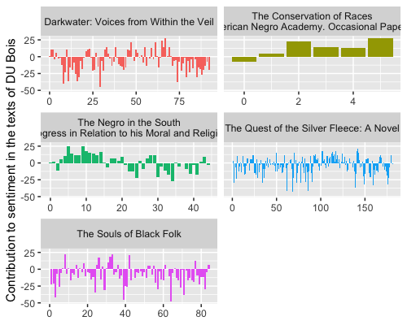
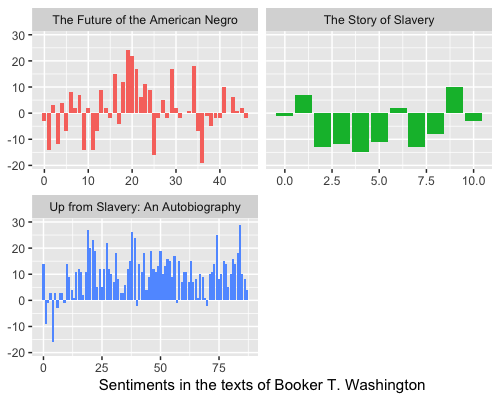
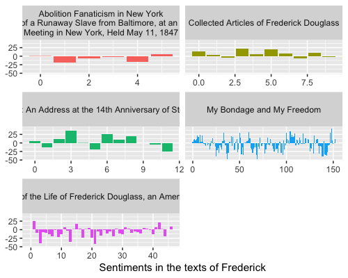
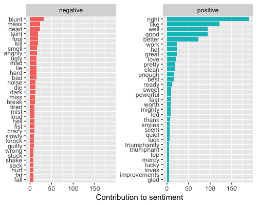
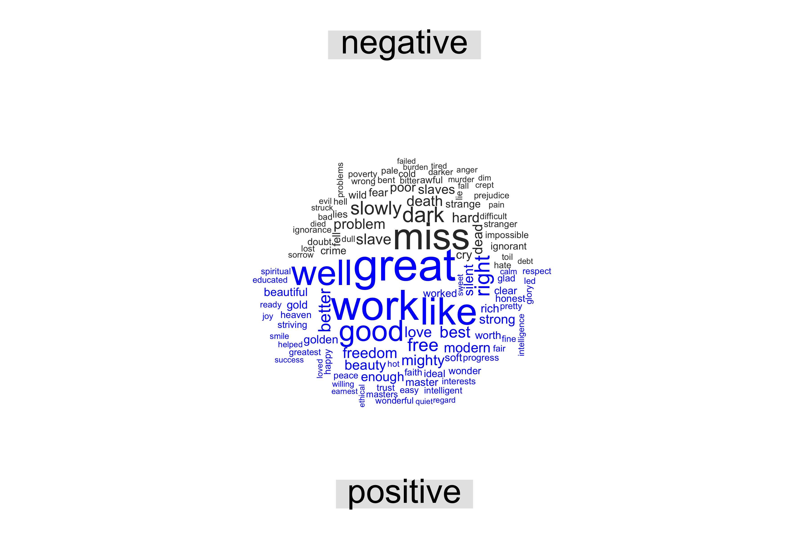
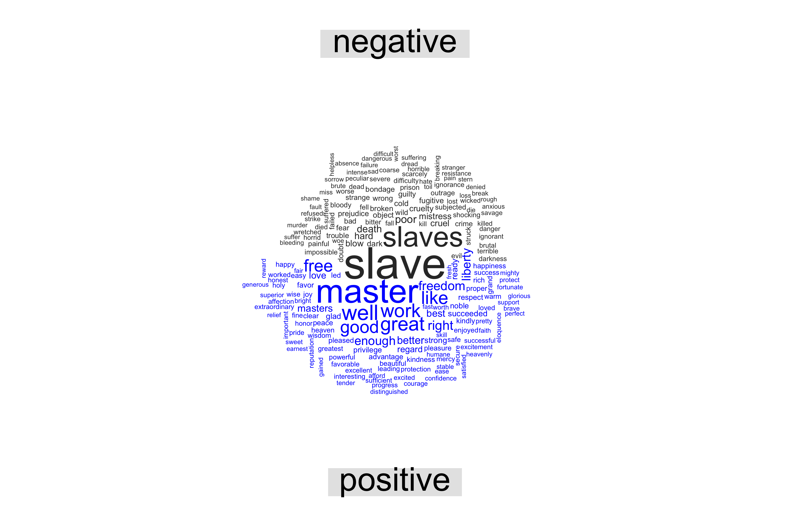

# Quantitative Analysis of four African American Authors' books
----
The objective of this document remains academic and personal. It is academic in the sense that it can provide materials for people to discuss the contents and to reproduce the codes while learning from the text mining process. It is also deemed to be a tutorial due to fact the code lines used to conduct the litteray study of the texts of some African-American authors might be useful for those who would like to analyse other texts found in the gutenberg project or elsewhere.
The  personal perspective of this piece of work is to be able to give proof of my ability to use R programming for text mining. On one hand, The study aims to quantify the books or any texts published by four (4) African-American authors known and revered for their writings about black Americans' issues in the US. On the other hand, this piece of work will present analyses that will be based on sentiments approaches and also figure out similar themes developped by these authors. The following authors are: Booker T. Washington (1890 -1915), W.E.B Du Bois (1868 - 1963), Frederick Douglass (1818 - 1985), and Zora Nearle Hurston (1891 - 1960). 
The authors' texts or books have been imported from the gutenberg project :  https://www.gutenberg.org/. What seems to be a contrast is that we had neither read the books which are being analyzed nor heard lectures about them when we decided to undertake this study. However, of all these texts considerded I have only read one single book by Booker T. Washington and one by W.E.B Du Bois. In a nutchell, We assume that they were all troubled and preoccupied by the same issues around their time. Therefore, their books tend to show similarities That one can notice through the lexical components. This piece of work is also about showing these similarities. 

Some results will be neither published nor commented. In order to see them, one needs to reproduce the codes if interested to see more results.

## Gathering and Tidying Data
As mentionned above, the books or texts are stored in a project called gutenberg project : https://www.gutenberg.org/. The import of data has been possible with the gutenberg package. The function ***gutenberg.download()*** has been pretty much useful to do the job. The best way to know the exact texts to download. One needs to know the ID of each book he would like to download. The ID can be found in the gutenberg project or a function can be used to find the ID of the text provinding the titles of the texts or books are known. Other packages have been utilized, such as:
* tidyverse
* tidydata
* stingr
* tidytext
* wordcloud
* ggplot2

The first thing to do to tidy the data collected is by tokenizing the texts into a bag of words, that is to say attribute a row to each word. I have noticed that some words are unnecessary and they have to be removed subsequently. They are not nouns or adjectives, but grammatical items. These grammatical items that have been removed refer to stopwords which later will be explained.  To list a few of these grammatical items, we can name such as articles, prepositions, identifiers, auxiliaries, conjunctions, and so on.  In case there is a need to know more about the stopwords that have been excluded from the text analysis, please refer to this link: https://www.ranks.nl/stopwords or http://xpo6.com/list-of-english-stop-words/. The tokenization has been done with grouping the texts according to the titles of the books by authors. Thus, it could be easier to display and quantify the words in respect to their titles.  

## Comments on the Results
--- 
The text studies are essentially based on some statistic approaches, such as frequency approach and the sentiments approach. We are interested in determing the words that have the high frequency, these words could appear in all these texts of the author more than once. Firstly, we take a glimpse of the number of words used by each author for each book or text. Considering the books alone, some authors used more words than others to write their stories. Zora Nearl Hurston used less amount of words among the four authors targeted in this study. In the same vein, Frederick Douglass comes second. In general, quantifying the amounts of words used by author to convey their messages or debate issues that preoccupied them comes down to the synthesis that W.E.B Dubois and Booker T. Washington are more verbose than two others regardless the writing styles and genres. The frequency approach lets appear the fact that Booker T. Washington is the least prolific writers among the group of authors considered. If we only base on the texts or books existed in the gutenberg project. An illustration might help picture the differences. 
#### Number of words for each text
| Du Bois's Books|Number of words|
|---|---|
|`The Souls of Black Folk`|6769|
|`The Quest of the Silver Fleece: A Novel`|14492|
|`His Economic Progress in Relation to his Moral and Religious Development`|3568|
|`Darkwater: Voices from within the Veil`|7420|

|Hurston's books|number of words|
|--|--|
|De Turkey and De Law: A Comedy in three Acts|3666|
|Poker!|199|
|The Mule_bone: A Comedy of Negro Life in three Acts|2142|
|Three Plays: Lawing;Forty Yards;Woofing|1025|

Before going further in the analysis, we decide not to present much about Nearle Hurston, because similarities between her texts and the others are not much noticeable. We determine the proportion of the same words used by the three authors. It helps use understand words that are likely to be used by authors and in what proportion in regards of the book or text. Let's take an example of a few words amongst a long list of words. 

|words|Washington|Du Bois|Douglass|
|--|--|--|--|
|abolition|0.01424|0.00614|0.0243|
|die|0.01424|0.00614|0.0162|
|hanged|0.01424|0.00614|0.0162|
|slavery|0.0284|0.00614|0.0324|

## Results and Graphs
the figures that are displayed below will be commented to get knowdledge out of them. the 4 first figures have to do with the sentiment analysis. The sentiment analysis does the job of summarize the feelings expressed by the texts. These feelings can be the authors'ones. They might be thereafter transfered to the readers When reading the authors' texts.

The sentiment analysis is mostly characterized by a binary distinction, such as positivity versus negativity or joy versus sadness. For Du Bois's case, we base our approach on NRC Emotion Lexicon . The sentiment analysis can subjectively make clear the feelings by which the authors were overwhelmed when they were writing any texts. By the same token, the same feelings can get through the authors's readers. When considering the figure above, the texts or books written by Du Bois except one of them bring more feelings toward negativity. More words tend toward negativity are used.  

For the Booker T Washington's case, we base our approach on the nrc lexicons.I prove this link to see on what we based to do the approach, https://rstudio-pubs-static.s3.amazonaws.com/236096_2ef4566f995e48c1964013310bf197f1.html. The binary distinction opposes joy to sadness. When analyzing the graphs, The book entitled "The Story of Slavery" bring more saddness than joy to the readers, however the book titled "The Future of the American Negro" makes the readers feel a sort of joy. Readers can experience bith joy and sadness. But, it is not clear saying that one feeling will prevail. The writer might be the one experince the feelings and transfer these feelings through his writings by picking unconsciously words that might expressing feelings related to joy or sadness.

The first article in the set of graphs for Frederick  Douglass is written by sombre words that might trigger someone's unhappiness about an issue. The articles that appear second and third in the set of graphs are filled with more exilirating attributes than sad words. Nevertheless, the last article reveal words related to sadness. The book entitled "My Bondage and my Freedom" is embeded with more words expressing sadness. 

This graph says much more about Neale Hurston's corpus stemmed from her collection of books than about each of her books. Its reason here is to show how we put the top words that are negative alongside those that are positive. It's obvious that there are more positive words in general when looking at the graph. But what is missing is to be able to decipher which book conveys more positive feelings than negative ones. This graph fails to let anyone make this judgement.

The wordcloud graph presents Du Bois's dichotomy of sentiments, positive versus negative. Du Bois's graph shows a lot of similarities with that of Booker T. Washington. Anyone can notice in the graph that work occurs in the Du Bois's texts almost as much as it does in Booker T. Washington's texts. Aroud work, other words can be found such as proud, freedom, love, educated, better. Both might not use the word work in the same context but what matters is that both want the former slaves' welfare. When considering slaves' treatment, the three authors used a lot  words such as: death, poor, fear, awful, murder, and poverty.

Frederick Douglass delineates the slaves with words that demonstrate personalities affected by the consequences of slavery. A few words, mostly adjective, that occur most repeatedly are the followings: sad, poor, subjected, ignorant, fugitive, and anxious. The slaves’ treatment was not less than severe and was characterized by words, such as: savage, brutal, bitter, cruel, killed or died, death or dead, severe, coarse, bleeding, bloody, murder and painful. We ponder the reason why work occurs a lot in Washington’s corpus. The answers that we can come up with are: first is that the former slaves might truly get freedom, pride, respect, love, success, happiness, reputation, relief, and safety. 

As far as Booker T. Washington In general, given the negative words associated with slaves, two aspects are essential to point out by gathering some lexical items that could carry two themes: the personality of the slaves and their treatments. The slaves were weak, ignorant, poor, broken, discouraging, and nervous. The slaves endured inhumane and subhuman treatments when considering these words: hard, difficult, hardships, servitude, trouble, condemnation, injury, burden, evil, and cruel. All these words can depict the vile lives and cruelty the slaves were subject to.

## Term Frequency- Inverse Document Frequency
Here we don't really discuss the term frequency, but in the code lines we pointed out the words that are more important and frequently used in each book after leaving out the stopwords such as: the, and, of, is, and so one. On top of it, a term's inverse documentfrequency was used. According to the this internet source, https://www.sciencedirect.com/topics/computer-science/inverse-document-frequency: ***The measure called term frequency-inverse document frequency (tf-idf) is defined as tfij*idfi (Salton and McGill, 1986). It is a measure of importance of a term ti in a given document dj. It is a term frequency measure which gives a larger weight to terms which are less common in the corpus. The importance of very frequent terms will then be lowered, which could be a desirable feature***. To explain in plain words, this approach will enable ones to see the words that occur more frequently in a collection of an author's books in hte context of this work. As mentioned above, we won't talk about them here. Anyone who is really to reproduce the code lines will see them as well as the comments. 

## Discussion and Perspectives

We will orient the discussion toward some weaknesses. Firstly, we notice a lack of semantic insights that this text mining analysis is subject to. Here, we only elucidate some semantic analysis based on a sentiment approach where the whole data are tokenized by bags of words, which refers to the isolation of each word per row. This sentiment analysis is envisioned to characterize the feelings that might arouse the authors' texts. Therefore, a contextual approach might have enabled ones to discover other possible feelings displayed in the texts, but are not perceived by the sentiment approach. In fact, contexts inside the texts can't be grasped by this sentiment analysis due to the fact that so many contextual components have been consigned into oblivion by this quantitative approach. People can notice that the word **master** appears in the positive side while it is used in a negative context. In their writing, Master represents the monstrous being in the eyes of the slaves. But, it is important to remind that the sentiment analysis enables us to perceive only the writer's feelings at the time that the texts were written, which is important but not sufficient to develop more insights into the whole feelings incorporated in the texts. 

We acknowledge that other feelings could have be considered by the nrc lexicons, such as anger, trust, fear, disgust..., But we only rely on the dichotomy joy and unhappiness when considered nrc lexicons. when it comes to bing, the dichotomy on which the analyis is based on is  positivity and negativity but the neutral variable has been omitted.
The discussion can always be taken to another level outside the context of this text mining. It is not possible yet, as far as we know, for any laymen  or students  to conduct certain text mining analysis on creole texts or creole books. Some packages don't really incorporate the creole lexicons. Udpipe package, which we didn't use, can't be used to analyse creole texts in the purpose for which it was designed. This package helps us identify the grammatical components. Another example is the universal dependencies. Creole is not part of the list of languages of the Universal Dependencies last time we checked. The possibility to use opinion and sentiment lexicons (bing, Afinn, NRC) have not been yet considered for the Haitian creole because a bing, AFinn, and NRC have not been established for creole. Therefore, we can't really attribute any sentiment to the words in creole. This work is left to the community of linguists and programmers to work on this project in order to make sure that creole can be used at this level of analysis.