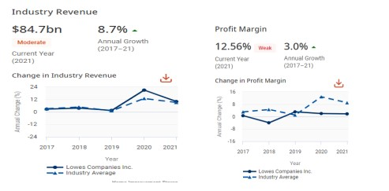
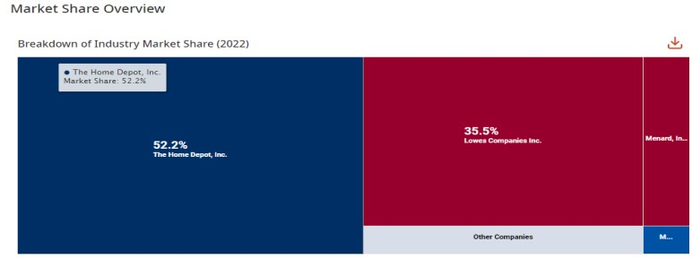
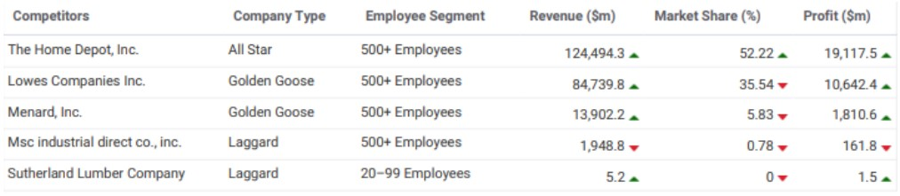
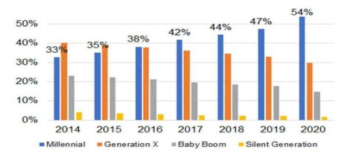
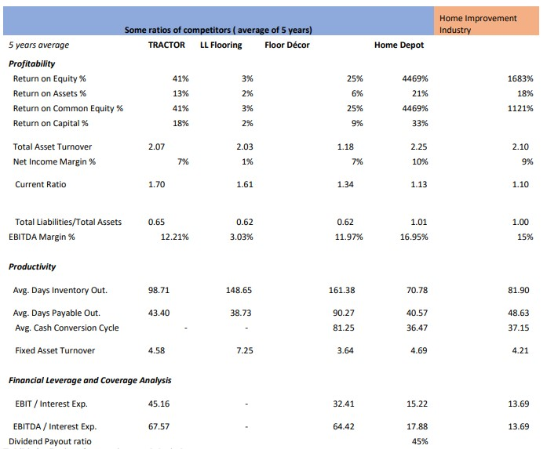
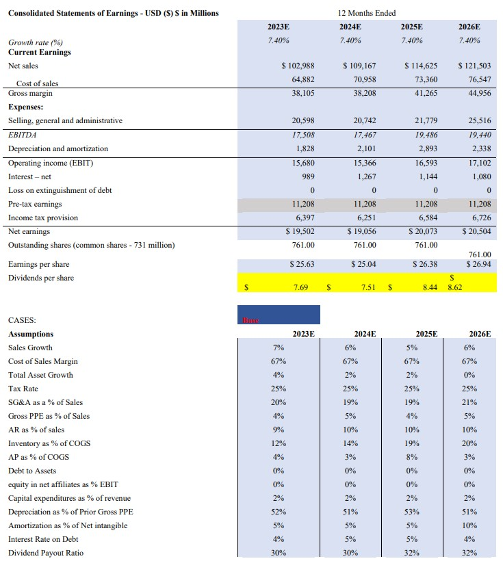
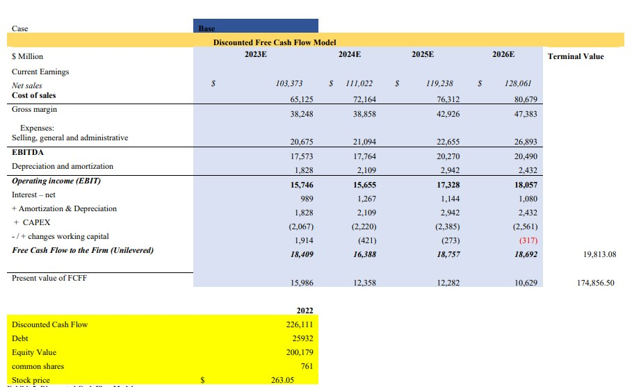

### 1 - Overview of Lowe’s Company

Lowe’s companies, Inc. (NYSE: LOW) is a fortune 50 home improvement company serving
approximately 10 million customer transactions a week in the United States and Canada. Lowe’s
and its related businesses operate or service nearly 2,200 home improvement and hardware stores
and employ over 300,000 associates. Based in Mooresville, N.C., Lowes Companies Inc. is a
public company headquartered in North Carolina. In the US, the company has a notable market
share in at least seven industries: BBQ & outdoor cooking stores, lawn and outdoor equipment
stores, large kitchen appliance, online small Electrical Appliance, Paint, etc. Their largest market
share is in the BBQ & Outdoor Cooking Stores where they accounted for an estimated 14.9% of
total industry revenue. Lowe’s has a total revenue of $ 84.7 billion. These data come from the IBIS
world report (Burns, 2022). Lowes are well known for his brands and trading names: Allen Roth,
Aquasource, Blue Hawk, Garden treasures, Harbor Breeze, Kobalt, Orchard, Project Source,
Reliabilt, Top Choice, Utilitech, Portfolio, etc. The industry has an annual growth of 3% of profit
margin.

Figure 1 - Industry Revenue Figure 2-Profit margin of Home Improvement sector

### 2- Macroeconomic Review and the impact of the economy on Lowe’s

The home improvement industry might be taken a temporary toll because the economy has been
affected by the inflation and other series of events such as the rising of the gas and basic and
necessary goods, War in Ukraine during 2022. The falling home sales are rippling through the
economy because of the rising interest rate that have themselves might cool down spending and
sales in the home improvement industries. The inflation rate was up at an annualized 8.3% rate in
August, the Bureau of Labor Statistics reported.
To extrapolate, when people buy new homes, they typically buy a lot to go inside including
appliances, curtains lighting fixtures, … In the article published by Wall Street
(Torry & Maloney,
2022), businesses spending has slowed or fallen this year as many home buyers moved to the
sidelines in the face of climbing interest rates. According to the Commerce Department, sales
declined in August from a year before by a seasonally adjusted 5.7% at electronics and appliances
stores. U.S existing home sales fell in July, the longest streak of declines in more than 8 years.
They dropped 20.2% from a year ago. Although sales are down, prices for household furnishings
and supplies -which include furniture, bedding, curtains and carpets -rose 1.1% in August from
July and were 10.6% higher than a year before. Lowes is very big in carpets. In another article
published by Wall Street by Cambon (2022), consumers expressed more pessimism about longrun economic prospects
. The analyst argues in her article that consumers are still battling highly
elevated price pressures for things like food and housing, even as declining prices at the pump
support modest improvement in consumer attitudes. In a nutshell, the economic downturn might
weigh a little heavy for Lowes to reap the profit they were expected for the year. A quarter or two
quarters for Lowes will be affected but the market will come back to its equilibrium with the Feds
trying to fight inflation in the short run.

## 2.1 - Industry Life Cycle

The home improvement industry’s life cycle is mature. Jonathan (2022) points out that the industry
value added is expected to increase relative in line with US GDP over the 10 years to 2026. The
IBS world report (2022) made the case that over the 10 years to 2027, industry value added (IVA),
which measures the home improvement stores industry’s contribution to the US economy, is
expected to increase at an annualized rate of 3.6%. During the same period, US GDP is forecast to
rise at an annualized rate of 1.8%. When industry growth falls relatively in line with US GDP
growth, it typically means that the industry is in the mature phase of its life cycle.

## 2.2- Lowe’s and Home Improvement Industry’s Analysis 

In this section, we are going to consider the Porter’s Five Forces Analysis to shed lights on the
competitive landscape and the factors affecting its sectors. This analysis will help measure and
understand the company’s position based on these following forces: threat of new entrants, threat
of substitutes, bargaining power of buyers, bargaining power of suppliers and competitive rivalry.

## 2.2.1 - Market Share Concentration

Home Improvement Stores industry concentration measures the extent to which the top players
dominate an industry. Two industry giants, the Home Depot Inc. and Lowes Companies Inc.
(Lowes), are expected to generate 90.3% of total industry revenue in 2022, making the Home
Improvement Stores industry highly concentrated. Home Depot and Lowe’s have taken advantage
of economies of scale and opened stores during period, while many smaller industry players have
closed their doors, according to the IBIS world report (Jonathan, 2022).

## 2.2.2 - Threat of New Entrants

Threat of new entrants is moderate. This industry requires a moderate degree of capital
requirements and exit barriers are also high. Establishing the brand reputation or building
economies of scale at the level of Lowe’s or retail brand is difficult. Pulling off a market presence
with a large market share and creating a bigger brand to compete with existing ones is a challenging
task.According to Ibis World (Jonathan, 2022), barriers to entry in this industry are medium and
steady. Lowes and Home Depots, the top two players are expected to account for 91.7% of the
available market share in 2022.

## 2.2.3 - Threat of Substitutes

Threat of substitutes is high, since its largely to DIY-ers and DFM-er who have access to varied
alternatives largely available at local stores or retailers like Walmart. These home improvement
products can also be customized and thus can be ordered from local brands without relying on
Lowes’ or others, Since the product offered by other retailers and its rival brands are not much
differentiated and mostly standardized, the threat of substitutes is high.

## 2.2.3 - Bargaining Power of Suppliers

IBIS world report (2022) that Bargaining power of suppliers is low. There are numerous suppliers
and only two major players who acquire most of the market. Switching cost of suppliers is also
low and thus Lowe’s and Home Depot easily switch to other alternative vendors globally. Most of
Lowes’s suppliers are use based and some of them are based in South Korea, Canada, China, etc.

## 2.2.4 - Rivalry or Competition

The industry experiences high levels of price competition while the industry is highly sensitive to
price. From the report of IBS world, Jonathan (2022) mentions that this industry is expected to
remain highly concentrated and competitive. This competition may decrease the industry growth
with the number of companies that are expected to decrease at 0.4% to 3,540 companies over the
five years to 2027.

## 2.3 - P/E ratios of Competing Companies 

The P/E ratio collected from yahoo finance for the competing companies show the stocks grow more in
terms of price appreciation if they invest in Flooring & Décor and Tractor than Home Depot and Lowes. It
also means that there is much more company growth for LL flooring and Flooring & Décor than the other
companies in the table below.

## 2.4 Sales of the industry

In 2022, profit is expected to account for 14.2% of industry revenue. The Home improvement
Industry makes $250.6 Billion. Profit will be higher for the Depot Inc. and Lowes than will be for
smaller industry players because the market share for the larger companies are capable of taking
advantage of economies of scales. The data was supported by Burn (2022).

Most revenue come from the lumber and other building and structural materials that account for
31.9% and the household appliance and kitchen goods and houseware that account for 30.7%.

## 2.5 - Wages of the Industry

Wages account for an estimated 8.7% of industry revenue in 2022. Wages have remained relatively
constant as a percentage of revenue due to operators’ ability to cut staff hours or switch to parttime labor during period demand.
2.6- Purchases in the Home Improvement Industry
The purchase of good sold is the largest expense for this industry. It is estimated to account for
56.8 % of the industry revenue. The merchandises come from directly the manufacturers
throughout the world. There is no middleman which makes the products sold at the lowest possible
price.

## 2.7- Marketing and Capital Expenditure

For home Improvement industry, marketing expenditure is relative low. They are usually estimated
to account for 0.8% of industry revenue in 2022. Not much money is invested in marketing because
there is a high brand recognition. The level of capital expenditure is also relatively low. In 2022,
it is forecasted that for 1$ spent by operators on wages, $ 0.13 will be allocated toward depreciation
cost. Most of the capital expenditure in this sector go to fixtures and fitting, cash registers and
point of sales (POS) systems.

### 3 - Relevant Stock Market Conditions and Prospects

The S&P 500 is considered to predict the outlook of the stock market on a long-term basis. From
1996 to mid-June 2022, S&P 500 returns. Short-term movements happen frequently in the stock
market but in a long term, it tends toward more stability on average. According to Mckinsey and
8
company, the mean total yearly returns (including dividends) of the S&P 500 from 1996 to midJune 2022 is 9% in the nominal terms, or 6.8% in real terms. In the past 60 years, the real cost of
equity has remained stable in 6.5% to 7% range. The long term P/E is 20.0x and P/BV is 3.8 X
and return on equity is 18.7% .

## 3.1 - Indicators for Future Growth for the Home Improvement Industry

## 3.1.2 - Housing market Trends

House price appreciation is slowing to a more moderate growth rate and McKinsey and Company3
(2022) expect it to be 12.8% and 4.0% in 2022 and 2023 respectively. The National Association
of Realtors forecasts that the 30-year average 2023 mortgage rate will be between 5% and 5.5%
throughout the majority of 2023. Those two factors might lead to sales growth because customers
who bought houses will need new appliances and other homes good. More house buyers
presuppose more customers and sales for Lowe’s.
3.1.2 Home Owners Equity trend
Past historical data indicate that the total homeowner equity has nearly doubled in the past 5 years.
It allowed people to own their home to feel richer or have more money apart to pay the loans to
use this money to improve their home. According to the latest annual homeowner report by
CoreLogic4
, the amount of equity in mortgaged real restate increased by more than $ 3.2 trillion
in Q4 2021, an annual increase of 29.3%. For the latest quarter (Q2 )2022, CoreLogic index5 with
mortgages (roughly 63% of all properties) has seen their equity increased since the second quarter
of 2021, a gain of 27.8% year over year. This is one of the factor that can contribute to sales growth
for the home improvement industry.

## 3.1.3 - The Age of the US Nation’s Housing

Brad Hunter (2021), a housing economist argue, in article published on Forbes, that approximately
80% of the nation’s 137 million homes are now at least 20 years old and 40% are at least 50 years
old. These houses will need to be renovated. This will represent an opportunity for sales increase
for the home improvement industry.

## 3.1.4 Demographic Population for the Home Improvement

According to the CoreLogic Loan Application Database, in 2020 the share of millennials in the
homebuying market soared 7 percentage points in 2020, reaching 54% of all purchase applications
(figure 1) . Millennial home purchase applications grew from 33% in 2014 to 47% in 2019, rising
about to 2 to 4 percentage points per year. The millennials are the new category of that are buying
the most houses now.

### 5. Analysis of the company’s financial Statements

## 5.1 - Historical Valuation

The analysis of Lowe’s financial position using past 10k forms, 10Q, financial ratios and peer ratio
analysis indicates a financially healthy company with a strong balance sheet, cash positions and
income statement. Total sales revenue grew from 1.18% to 7.43% from respectively January 2019
to January 2022. Amid pandemic, Lowe’s managed to have a positive gross margin from 0.15%
to 8.40% respectively from January 2019 to January 2022. Its Net income has an upward trend
from 2019 to 2022. Net income margin (return on sales) represents 9% of the sales in
2021 while it was 3% in 2019. The cost of sales represents more than 6% of the revenues.
The company has been more profitable on a yearly basis considering the three consecutive years
(2019-2021). This is good news for the shareholders that they have more returns on their
investments. In the mist of pandemic, the company has grown more profitably, from 11.24% to
24.09%. The sustainable growth of the company even is even indicated by the return on assets.
The company make more revenues and more profit margins relative to the three previous years.
The company has been generated more sales over the assets used to conduct the essential
operations.
Lowe’s has taken nearly the same short-term debts to buy short term assets to generate more sales,
pay employees and suppliers. The 2021 year has brought more sales revenue and more profit
margin while the short-term debts remained the same.
The cash conversion cycle (CCC) is one of the quantitative measures that we use to evaluate the
efficiency of Lowe’s. the CCC has been improved from 40.95 days to 32.86 days respectively
from 2019 to 2021. This metric considers how much the company needs to sell its inventory, how
much it takes to collect receivables, how much time it must pay its bill. The lower the CCC is, the
better. The increases in account payable turnover in days and the inventory in days for 2021 is
understood because Lowes had to buy more inventory to make more sales revenue. Lowes
manages to keep debt expenses relatively low compared to the previous years. Lowes generated
enough earnings before interest and taxes to cover its total debt. Its EBIT is 13.66 times the total
debts it needs to pay. The Cash from operations is superior to the total debt. It means the company
can easily pay its debts without selling its fixed assets.

Lowe’s sent a good signal by managing the keep the selling, general and administrative expenses
(SG&A) category lower. Such expense, second to sales of cost the biggest expenses, used to
represent 21% of sales for the previous year 2019 and 2020. But in 2021, SG&A’s expenses
lowered to 19%, which increased its profit margin.
5.2 - Comparison between Lowes, its competitors, and the Home Improvement Industry
Lowe’s has performed better than and above the home improvement industry. The capital
providers (investors and debtors) are better off investing in Lowes compared to other competitors
except Home Depot. The return on equity 2409% in 2021 increased compared to the ROE in 2019.
The EBITDA margin is better than all its competitors and the sector and its earnings before Interest
and depreciations 22 times its debt, which is above the debts to EBITDA of the sector.

### 6 - Financial Projections

## 6.1 - Methodology of the forecasting

The methodology used to project Lowe’s performance in the future is based on a combination of
different methods, ratio, linear regressions and trends. The Forecast initially was based on three
different scenarios or cases: the base case makes the case the economic condition is normal i.e.
no recession. The growth, the accounting and management do not deviate the normal course. The
best case is where the economic condition is ideal in the sense there is high abnormal growth in
the economy and the industry. There is a better management of resources compared to the based
case. The worse case is where there is economic downturn and mismanagement of resources.
For the forecast of the base case scenario (which we will only consider for the purpose of this
assignment), some assumptions were used to estimate some ratios and indicators of trend in
order to deduce some parameters, such as sales growth, SG&A as % of sales, inventory as % of
GOGS, and so on (refer to the excel spreadsheet).

### 7 -Application of valuation Methodologies

## 7.1 - DCF Valuation

Lowe’s stock price estimate based on DCF valuation relied on the following three components: 1)
discount rate, 2) cash dividend forecast, and 3) terminal value. To estimate the required rate of
return, six years of data have been collected for Lowe’s daily return, the broad-based market index,
and treasury bill. A beta of 1.09 has been estimated though linear regression. An adjusted Beta of
1.06 has been estimated because it is a forward-looking approach. A risk premium of 9.89% has
been estimated by using Gordon Growth Model approach because it is a forward-looking estimate
of the equity risk premium. The Gordon Growth equity risk premium, the adjusted beta, the yearly
average risk free, 4.6%, are used to estimate the CAPM (required rate of return). The required rate
of return is 15.16%.
The company has an earnings retention rate that is constant 70%, the historical dividend payout
ratio of 30% on average of the 4 years forecasted. The ROE from the DUPONT analysis is 13.94%.
We use single-staged model to estimate the equity value of Lowe’s because it is a very mature
company. Exhibit 3 presents the terminal value is $ 102.69 and the final stock price calculation
based on the P/E approach. The stock value per share is $ 125.86 and the P/E approach assumes a
4.9 P/E ratio to Lowe’s estimated EPS of $ 25.69. This DCF model is less appropriate for this
work.

## 7. 2 - Discounted Cash Flow Valuation

Lowe’s Discounted Cash Flow model is used to estimate the equity value per share. A two-staged
DCF is used to value the common equity of the company. The revenues are expected to grow
constantly by 7% for the 4 consecutive years and continue to grow in perpetuity by 6% after the
forecasted period. The WACC, 12.96%, has been estimated by using the market value of the equity
14
and debt. The reference to calculation regarding the market value of debt, $ 25,932 million in the
excel spreadsheet. The equity value per share is $ 263.05 (Exhibit 5).

### 8 - Recommendations

For the purpose of the assignment, the DCF model will be considered to based our
recommendations on. We position ourselves as buy-side analysts. So to speak, we report valuation
judgements to a portfolio manager or investment committee as input to an investment decision
(Pinto & al., 2020). The stock price per share is $ 263.05 and the market price is $ 187.91. The
stock is undervalued. It is the right time to buy the Lowe’s stock at $ 187.91, which is displayed
on yahoo finance on 10/02/2022.

### Bibliography

Boesel, M. (2022, May 16). Homeowners gained over $3.2 trillion in home equity in 2021. Retrieved
September 2022, from CoreLogic: https://www.corelogic.com/intelligence/homeownersgained-over-3-2-trillion-in-home-equity-in-2021/

Burns, J. (2022, July). Home Improvement Stores in the US. Retrieved September 2022, from IBISWorld
Database: https://my.ibisworld.com/us/en/industry/44411/about

CoreLogic. (2022, september 9). Homeowner Equity Insights. Retrieved September 2022, from
CoreLogic®: https://www.corelogic.com/intelligence/homeowner-equity-insights/

Easton, P. D., McAnally , M. L., & Sommers, G. A. (2021). Financial Statement : Analysis & Valuation. (6e,
Ed.) Canada: Cambridge Business Publishers.

Hunter, B. (2021, September 20). Forbes. Retrieved September 2022, from 3 Reasons Home
Improvement Is The Fastest-Growing Retail Category, And What To Watch For:
https://www.forbes.com/sites/bradhunter/2019/07/25/three-reasons-why-homeimprovement-is-the-fastest-growing-retail-category-and-what-to-watch-for/?sh=1deb0a4531d7

Miao, H. (2022, September 6). Morgan Stanley Forecasts Decline in S&P 500 Earnings for 2023. Retrieved
September 2022, from The Wall Street Journal: https://www.wsj.com/livecoverage/stockmarket-news-today-09-06-2022/card/morgan-stanley-cuts-s-p-500-earnings-forecastsUYud158LwoZcTBYmnQ6o

Pinto, J., Henry, E., Robinson, T. R., & Stowe, J. D. (2015). Equity Asset Valuation. New Jersey: CFA
Institute.

Pradhan, A. (2022, May 16). Millennials Lead the Pack for Home Purchases. Retrieved from CoreLogic:
https://www.corelogic.com/intelligence/millennials-lead-the-pack-for-home-purchases/

Pwc. (2017, February). The Long View: How will the global economic change in 2050. Retrieved
September 2022, from PWC: https://www.pwc.com/gx/en/world-2050/assets/pwc-the-worldin-2050-full-report-feb-2017.pdf

Standard & Poor's. (2022). Floor and Decor Holdings. Retrieved September 2022, from NetAdvantage
database: https://www-capitaliqcom.eu1.proxy.openathens.net/CIQDotNet/company.aspx?companyId=270357747

Standard & Poor's. (2022). Flooring & Decor. Retrieved September 2022, from NetAdvantage Database:
https://www-capitaliqcom.eu1.proxy.openathens.net/CIQDotNet/company.aspx?companyId=270357747

Standard & Poor's. (2022). Home Improvement Industry. Retrieved September 2022, from NetAdvantage
database: https://www-capitaliqcom.eu1.proxy.openathens.net/CIQDotNet/Index/IndexWidgetTearsheet.aspx?companyId=267
1458

Standard & Poor's. (2022). NetAdvantage Database. Retrieved September 2022, from LL Floring
Holdings: https://www-capitaliqcom.eu1.proxy.openathens.net/CIQDotNet/company.aspx?companyId=4373805

Standard & Poor's. (2022). S&P 500 Index. Retrieved September 2022, from NetAdvantage database:
https://www-capitaliqcom.eu1.proxy.openathens.net/CIQDotNet/company.aspx?companyId=278679
22

Standard & Poor's. (2022). The Home Depot, Inc. Retrieved September 2022, from S&P NetAdvantage
Database: https://www-capitaliqcom.eu1.proxy.openathens.net/CIQDotNet/company.aspx?companyId=278679

Strauss, L. C. (2022, July 15). The Future Looks Rough for S&P 500 Dividends. Retrieved from Barron's:
https://www.barrons.com/articles/sp500-dividend-stocks-51657829818